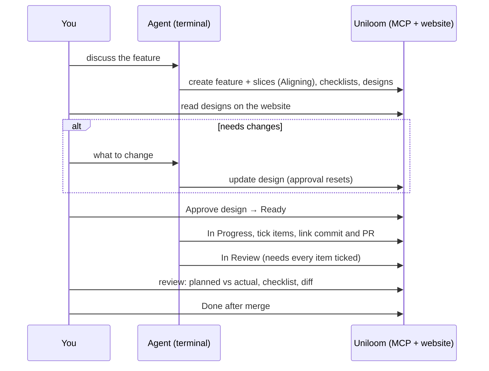

# Uniloom: MVP

Uniloom is a self-hosted work tracker for people who build software **with a coding agent**.

- You talk to your agent **in the terminal** (Claude Code). The agent creates and updates work in Uniloom through an **MCP server**.
- The **website** is where people read, approve and review. There is no agent chat on the website.
- Two modes:
  - **Guided** is the design-first workflow: you approve how a slice will be built before any code is written.
  - **Standard** is a normal Jira-style tracker for people who don't want that workflow.

The name: slices are threads, and a feature is the fabric they're woven into.

---

## 1. Goals

- **Own the tool.** Our rules, our data, our database.
- **Pair programming with an agent.**
  - You are the navigator: agree the feature, approve the design, review the result.
  - The agent is the driver: it writes the design and the code.
- **Know every function before it's written.** Each slice's design lists the functions, what each does and **why** it's needed, plus the flows. When you review the code, you already know what everything is for.
- **Catch wrong turns early.** A wrong approach is caught on a list of functions, not in a finished diff.
- **Keep the decisions.** Architecture decisions (ADRs) live next to the work and outlast any one feature.
- **Work for everyone.** Teams who just need a tracker use Standard mode.

## 2. Non-goals for the MVP

- Chatting with an agent on the website.
- Running agents from the website (no "Start" button, no runner). That's a possible later version.
- Sprints, story points, time tracking.
- Initiatives (a level above features).
- Automatic done-when checks (command-, policy- or model-based criteria). Items are ticked by people or agents.
- Notifications by email or chat.

---

## 3. Modes

A project has one mode. Each mode is a **preset of rule switches** in one workflow engine, not a separate product.

|                             | **Standard** (like Jira)                                 | **Guided** (design-first)                                                                        |
| --------------------------- | -------------------------------------------------------- | ------------------------------------------------------------------------------------------------ |
| Work items                  | Tasks → Subtasks                                         | Features → Slices                                                                                |
| States                      | Custom per project (default: To Do → In Progress → Done) | Fixed: Triage → Backlog → Aligning → Ready → In Progress → Blocked → In Review → Done → Canceled |
| Done-when checklist         | Optional, any length                                     | **Required, 3–6 items**. Gates In Review and Done                                                |
| Design before Ready         | No                                                       | **Required**, approved by a manager                                                              |
| Planned vs actual at review | No                                                       | Yes                                                                                              |
| ADRs                        | Available                                                | Available, and linked from designs                                                               |
| Agents via MCP              | Create, update, move, comment                            | Same, plus designs and records. **Agents can't approve**                                         |

### Rule switches

States are not a switch: they are locked in Guided, because its rules rely on them, and editable in Standard.

| Switch                | Standard       | Guided                                             |
| --------------------- | -------------- | -------------------------------------------------- |
| `item_names`          | Task / Subtask | Feature / Slice                                    |
| `checklist_required`  | `false`        | `true`                                             |
| `design_required`     | `false`        | `true`                                             |
| `approval_required`   | `false`        | `true`                                             |
| `approver_not_author` | n/a            | `true` (can be turned off in a one-person project) |
| `planned_vs_actual`   | `false`        | `true`                                             |

- **Per-label overrides.** In Guided mode, `bug` and `chore` can skip the design. In Standard mode, one label could require a checklist.
- **Switching modes later** is a setting change. Existing items keep their data, and the new rules apply from then on.
- **All rules live in one place on the server.** The MCP tools and the website call the same check, so they can never disagree.

Mode names are still open: "Standard / Guided" or "Classic / Paired".

---

## 4. Core concepts

### Project

- A name, plus a **key prefix** such as `UG`. Items are numbered `UG-1`, `UG-2`, and so on.
- A mode (Standard or Guided), plus its switch values and label overrides.
- Labels, for example a `type` group: `bug`, `feature`, `chore`, `tech-debt`.

### Users and roles

People sign in with **uniAuth**. Access to a project is by invitation.

| Role        | Can do                                                                                                           |
| ----------- | ---------------------------------------------------------------------------------------------------------------- |
| **Owner**   | Everything: change roles, remove members, key prefix, labels, mode and switches, delete the project              |
| **Manager** | Create and delete tickets and subtasks, add members (as Member only), approve designs, accept ADRs, move to Done |
| **Member**  | Read, comment, edit tickets and move tickets assigned to them (not to Done). Works through their own agent       |

- **Each person's agent acts as that person.** Every user creates their own access token for their agent. The site shows "Mya's agent created UG-12".
- **Approver ≠ author** (Guided): a design written by Mya's agent is approved by a different manager, unless the switch is off.

### Work items

| Field              | Notes                                                         |
| ------------------ | ------------------------------------------------------------- |
| Key                | `UG-12`                                                       |
| Title, description | Markdown, with Mermaid diagrams                               |
| Type               | Feature/Slice (Guided) or Task/Subtask (Standard)             |
| State              | See modes                                                     |
| Assignee           | One user                                                      |
| Priority           | Urgent, High, Medium, Low, None                               |
| Labels             | Exclusive groups enforced (one `type` label)                  |
| Blocked by         | Keys of items this one waits on                               |
| Parent             | Slice → Feature, or Subtask → Task                            |
| Checklist          | Done-when items, each with a done state and optional evidence |
| Design             | Guided only. See §6                                           |
| Comments           | Thread per item, by people and agents                         |
| Record             | Commits, branch, PR, documents                                |

**Fixed depth.** Guided has two levels: a slice can't have slices, and a slice that is too big becomes more slices of the same feature. Standard has two as well: Task → Subtask. The rules engine enforces the depth (ADR-0003).

**A feature is Done automatically** when all its slices are Done or Canceled.

---

## 5. Guided workflow



1. **Discuss** the feature in the terminal with the agent until you agree.
2. **Agent creates** the feature and its slices over MCP, in **Aligning**. Each slice gets 3–6 done-when items and a **design**.
3. **You read** each design on the website. Change requests go back to the agent in the terminal. Any edit to an approved design **resets the approval**.
4. **A manager approves** the design on the website, and the slice moves to **Ready**. Only people can do this. There is no MCP tool for it.
5. **Agent implements:** In Progress. It ticks each item **the moment it's met**, links the commit and PR, and writes the change document.
6. **In Review** is allowed only when every checklist item is ticked.
7. **You review** on the website: the approved design next to what was built (planned vs actual), the checklist, the commits.
8. **Done** after merge. Set by a manager, never by an agent.
9. **Blocked:** if the agent can't finish without a person, the slice moves to Blocked with a reason.

### Splitting a feature into slices

- Each slice is a **vertical slice**: end to end (database + API + UI + tests), reviewable and shippable on its own.
- **3–6 done-when items per slice, enforced.** A 7th item is rejected with "split this slice". 3–6 is the Guided default and is shown as recommended in settings; an owner can change the limits per project. The limits are fixed, not a setting.
- **About 8 meaningful functions per slice** is a soft cap. Above it the website warns "this slice may be too big to review", but doesn't block.
- Slices can wait on each other with **blocked by**.

### Feature-level vs slice-level

|           | Feature                                    | Slice                               |
| --------- | ------------------------------------------ | ----------------------------------- |
| Design    | Overview flow: how the slices fit together | Functions plus detailed flows       |
| Approval  | The split and the overview, once           | Each slice's design, before Ready   |
| Checklist | Optional                                   | Required, 3–6                       |
| Done      | Automatic when all slices are Done         | When a manager marks it after merge |

---

## 6. Designs (Guided)

A design says **how a slice will be built**, so the manager understands every function before it exists.

| Part          | Content                                                                                                                  |
| ------------- | ------------------------------------------------------------------------------------------------------------------------ |
| **Functions** | One row each: name and signature, file, **what it does**, **why it's needed** (which requirement or flow step it serves) |
| **Flows**     | Mermaid diagrams (sequence or flowchart) of how functions, routes and services call each other                           |
| **Notes**     | Decisions and trade-offs, and links to ADRs ("follows ADR-7")                                                            |

Rules:

- **List only meaningful functions:** exported functions, routes, guards, services, components with logic. No small private helpers.
- **At least one function and one flow** before the design can be approved.
- **Approval belongs to people**, on the website, by a manager (≠ author when that switch is on).
- **Editing an approved design resets its approval.**
- Example function row:

  | Function                         | File                     | What                                                     | Why                                                                          |
  | -------------------------------- | ------------------------ | -------------------------------------------------------- | ---------------------------------------------------------------------------- |
  | `takeReturnTo(): string \| null` | `web/src/lib/uniauth.ts` | Reads and clears the saved return page, same origin only | `/auth/return` needs to know where the visitor started after a uniAuth error |

### Planned vs actual (at review)

- When a commit is linked, Uniloom **reads the commit's diff itself** and lists the functions added and changed. The agent doesn't write this list. It's cheaper, and the agent isn't reporting on its own work.
- The review page shows three groups:
  - **Planned and built**: matches, with file and line.
  - **Extra**: built but not in the design. Flagged so the manager can ask why.
  - **Missing**: in the design but not found.
- Open question: should extra functions **block** In Review until a manager accepts them, or only be flagged? MVP default: **flag**.

---

## 7. Architecture decision records (ADRs)

ADRs record **choices that outlive one slice**, such as "Postgres over SQLite" or "the silent check runs in the browser, not the proxy".

| Field            | Content                                                      |
| ---------------- | ------------------------------------------------------------ |
| Number and title | `ADR-7: Silent sign-in runs in the browser`                  |
| Status           | Proposed → Accepted, or Rejected. Later: Superseded by ADR-n |
| Context          | The problem and the constraints                              |
| Options          | Each option with pros and cons                               |
| Decision         | What was chosen                                              |
| Consequences     | What becomes easier or harder                                |
| Links            | Features and slices it affects                               |

- Usually written **in Aligning**, by the agent over MCP, when a feature involves a real choice.
- **Accepted only by a person** (manager or owner) on the website.
- Designs reference ADRs instead of repeating the reasoning.
- Agents **read** them (`list_adrs`, `get_adr`), so new work follows past decisions instead of re-arguing them.
- **Never deleted, only superseded**, so the history stays readable.
- Available in both modes.

---

## 8. Record: commits, PRs and documents

- **Commits:** SHA, message, URL, linked to an item. Several per item are allowed.
- **Branch and PR URL** on each item.
- **Documents:** engineering write-ups attached to an item, a feature or a project.
  - Types: `change`, `feature`, `reference`, `overview`. ADRs are their own type (§7).
  - Markdown with **Mermaid rendered** on the website.
- **Finishing a slice** (Guided): link the commit, set the branch and PR, write the change document ("what changed and how", with a diagram for backend flows), move to In Review.

---

## 9. MCP server

Agents connect with `claude mcp add` to `https://<api>/mcp` (Streamable HTTP), sending the user's **access token** in a header.

### Tools

| Area              | Tools                                                                                                                             |
| ----------------- | --------------------------------------------------------------------------------------------------------------------------------- |
| Projects          | `list_projects`                                                                                                                   |
| Items             | `list_items` (slim rows), `get_item`, `save_item` (create, update, move; refused if a rule fails, with the reason), `delete_item` |
| Checklist         | `set_criteria`, `check_criterion` (by 1-based index or text, with evidence), `get_criteria`                                       |
| Design            | `set_design` (functions, flows, notes), `get_design`                                                                              |
| ADRs              | `save_adr`, `get_adr`, `list_adrs`                                                                                                |
| Comments          | `save_comment`, `list_comments`                                                                                                   |
| Labels and states | `list_labels`, `list_states`                                                                                                      |
| Record            | `link_commit`, `set_item_dev` (branch, PR), `save_document`, `get_document`, `list_documents`, `list_items_missing_docs`          |

**There are no MCP tools to** approve a design, accept an ADR, move to Ready, or move to Done. Those happen only on the website, by people.

### Server behaviour

- **Server `instructions`** sent to every agent: the states, the mode's rules, the 3–6 limit, "agents can't approve", and the item and design formats.
- **Slim responses:** list tools return short rows. Full detail comes only from `get_*`.
- **Rule errors are explicit**, for example `criteria_incomplete` listing the unticked items, `design_not_approved`, or `checklist_max_exceeded: split this slice`.
- Every change is recorded in an **activity log** (who, which agent token, what, when).

## 10. Agent setup files

Written after the MCP server works, so they describe the real tools.

| File                                   | Where                                    | Purpose                                                                                                             |
| -------------------------------------- | ---------------------------------------- | ------------------------------------------------------------------------------------------------------------------- |
| MCP `instructions` + tool descriptions | In the server                            | The **rules**, sent automatically                                                                                   |
| `SKILL.md`                             | `~/.claude/skills/uniloom/`              | The **workflow**: discuss → create in Aligning → design → wait for approval → implement → tick → record → In Review |
| `DESIGN.md`                            | skill folder                             | How to write a design: which functions count, how to write "why", when to use a sequence diagram vs a flowchart     |
| `SLICES.md`                            | skill folder                             | How to split a feature into vertical slices with 3–6 items                                                          |
| `MERMAID.md`                           | skill folder                             | Diagram rules                                                                                                       |
| Rules block                            | Each project's `AGENTS.md` / `CLAUDE.md` | **Project specifics**: project key, labels, personal rules ("confirm before creating", "stop at In Review")         |
| Slash command (optional)               | `~/.claude/commands/`                    | A shortcut such as `/feat` to start a feature discussion                                                            |

---

## 11. Website

Signed-in people only (uniAuth). No agent chat.

| Page              | Content                                                                                                                       |
| ----------------- | ----------------------------------------------------------------------------------------------------------------------------- |
| Sign-in           | uniAuth (silent check, login, consent pattern from Unigym)                                                                    |
| Projects          | List, create, settings: mode, switches, labels, members and roles, invites                                                    |
| Board             | Columns by state, filter by assignee, label, feature. Drag to move where the rules allow                                      |
| Feature page      | Overview flow, slices with progress, ADR links                                                                                |
| Slice / task page | Description, checklist with evidence, **design** (functions table + flows), **Approve** button for managers, comments, record |
| Review page       | **Planned vs actual**, checklist, commits and PR, change document                                                             |
| ADRs              | List by status, ADR page, **Accept / Reject** for managers                                                                    |
| Documents         | List and page with Mermaid rendering                                                                                          |
| Activity          | Who (person or agent) did what, per item and per project                                                                      |
| Account           | Access tokens for agents: create, name, revoke                                                                                |

---

## 12. Sign-in and access

- **People:** uniAuth over OIDC, with Better Auth in the API, exactly as Unigym does it.
  - The web app proxies `/api/*`, so the session cookie stays on the web host.
  - Host-only cookie with prefix `uniloom`, 7-day sliding session.
  - Silent check, `/auth/return`, a consent screen for Uniloom's own terms.
- **Agents:** **personal access tokens**, created on the website, scoped to the user and revocable. Sent as `Authorization: Bearer <token>` to `/mcp`. Stored hashed.
- **Permissions** are checked on the server for every request, website and MCP alike, by role and by rule.

---

## 13. Stack

| Part     | Choice                                                                                | Why                                                                                                                                                                                                                                                          |
| -------- | ------------------------------------------------------------------------------------- | ------------------------------------------------------------------------------------------------------------------------------------------------------------------------------------------------------------------------------------------------------------ |
| Runtime  | **Bun** workspace                                                                     | Same as Unigym. Runs TypeScript directly, built-in test runner                                                                                                                                                                                               |
| API      | **Hono** in `apps/api`                                                                | Small and Bun-native. Serves the REST API, Better Auth and the MCP endpoint                                                                                                                                                                                  |
| MCP      | **`@modelcontextprotocol/sdk`**, Streamable HTTP at `/mcp`                            | Works with `claude mcp add`                                                                                                                                                                                                                                  |
| Database | **Postgres + Prisma 7** (`@prisma/adapter-pg`)                                        | Postgres already runs on Oracle. Prisma is familiar from Unigym, so agent-written data code is easy to review. Prisma 7 has no native engine and runs on Bun                                                                                                 |
| Web      | **Next.js** in `apps/web`                                                             | Familiar from Unigym, so the same review comfort. Same architecture: proxies `/api/*` to the API, and the uniAuth sign-in from Unigym carries over. Routing, layouts and server components suit the many read-only pages. Cost: two processes instead of one |
| Diagrams | Mermaid, rendered in the browser                                                      | Same format agents already write                                                                                                                                                                                                                             |
| Sign-in  | Better Auth + uniAuth (`genericOAuth`)                                                | Proven in Unigym                                                                                                                                                                                                                                             |
| Tests    | `bun test` / Vitest; API e2e with a mock uniAuth; browser checks with headless Chrome | Same approach as Unigym                                                                                                                                                                                                                                      |

```text
uniloom/
├── apps/
│   ├── api/   # Hono: REST, Better Auth, MCP (/mcp), rules engine, Prisma
│   └── web/   # Next.js: board, items, designs, reviews, ADRs, settings
├── skill/     # SKILL.md, DESIGN.md, SLICES.md, MERMAID.md
└── MVP.md
```

---

## 14. Build order

Each step is one slice with its own design and done-when checklist. From step 4, Uniloom tracks its own work.

| #   | Slice                                                                                                   | Build   | Review  | Notes                                  |
| --- | ------------------------------------------------------------------------------------------------------- | ------- | ------- | -------------------------------------- |
| 1   | Project setup: Bun workspace, Hono, Next.js, Postgres + Prisma, lint, tests, CI                         | ½ day   | ¼ day   |                                        |
| 2   | Data model: projects, items, states, labels, blocked-by, assignee, priority, comments                   | ½–1 day | ¼–½ day |                                        |
| 3   | Rules engine: mode presets, switches, label overrides, checklist limits and gates, design approval gate | 1 day   | ½ day   | Switches from day one                  |
| 4   | MCP server: tools, instructions, access tokens, activity log                                            | 1 day   | ½ day   | **Usable from Claude Code after this** |
| 5   | Sign-in: uniAuth, sessions, consent (reused from Unigym)                                                | ½ day   | ¼ day   |                                        |
| 6   | Users and roles: members, invites, owner / manager / member, approver ≠ author                          | ½–1 day | ½ day   |                                        |
| 7   | Designs and ADRs: design storage, approval reset, ADR statuses and links                                | ½–1 day | ½ day   |                                        |
| 8   | Web: board and item lists, both modes                                                                   | 1 day   | ½ day   |                                        |
| 9   | Web: slice page with design review and **Approve**, ADR pages with **Accept**                           | 1 day   | ½ day   |                                        |
| 10  | Record: commits, PRs, documents with Mermaid                                                            | ½ day   | ¼ day   |                                        |
| 11  | Planned vs actual: read functions from the diff, review page                                            | ½–1 day | ½ day   |                                        |
| 12  | Agent setup files: skill + `AGENTS.md` block, tried on a real Unigym feature                            | ½ day   | ½ day   |                                        |

**Estimate: about 9–14 working days**, review included (reviews overlap with building). Not included:

- deploying (k8s-practice, DNS, sealed secret: about ½–1 day plus waiting on the maintainer);
- UI polish beyond clean and functional;
- part-time days, which stretch the calendar.

**First milestone: slices 1–4 in about 2–3 days.** That's a working tracker driven from the terminal, enough to track new work in Uniloom.

---

## 15. Cost notes

- No agent runs on the server, so there's **no API billing** from Uniloom itself. Agents are your normal Claude Code use.
- Guided mode adds a little per slice (writing the design) and saves on rework, because wrong approaches are caught before code.
- Keeping it cheap:
  - only meaningful functions in designs;
  - automatic planned vs actual;
  - slim MCP responses;
  - `bug` and `chore` can skip designs.

## 16. Open questions

1. Should extra functions at review **block** In Review, or only be **flagged**? (MVP default: flag.)
2. Mode names: **Standard / Guided** or **Classic / Paired**?
3. ~~Drizzle or Prisma?~~ Prisma (decided: familiar from Unigym).
4. Where to deploy (k8s-practice like Unigym?), and the hostnames.
5. Which Standard-mode extras come after the MVP: sprints, story points, time tracking?
6. ~~Should Uniloom's own work be tracked in Markdown under `plans/` until slice 4 works?~~ Yes: plans, ADRs and tech debt live in `docs/`.
7. **Milestones (after the MVP, ADR-0006):** a name and a due date inside a project; a task points to one milestone (its subtasks follow it). A milestones page with a progress bar per milestone ("7 / 12 tasks done, due in 3 days"), a milestone filter on the board and a picker on the item page. Open: who may edit them (any member?), and whether a finished milestone can be closed.
