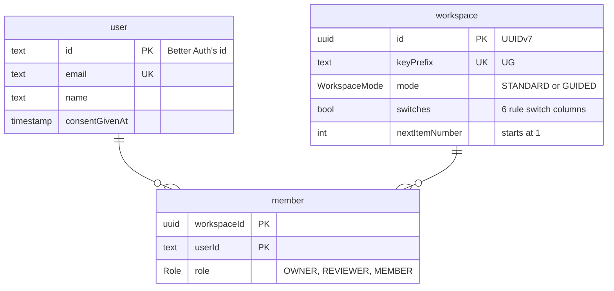

# 02: Workspaces and people

Status: In Review

## Scope

The first tables: people, workspaces with their mode and rule switches, and who belongs
to which workspace with which role (MVP §3, §4).

Left out: filling the switches from a mode preset (rules engine), routes, invites and
sign-in. Later features add their own tables, one at a time:

| #   | Feature                               | Tables                                     |
| --- | ------------------------------------- | ------------------------------------------ |
| 2   | **Workspaces and people** (this plan) | `user`, `workspace`, `member`              |
| 3   | Items                                 | `state`, `item`, `item_block`              |
| 4   | Labels                                | `label_group`, `label`, `item_label`       |
| 5   | Comments                              | `comment`                                  |
| 6   | Checklist                             | `criterion`                                |
| 7   | Agent tokens and activity log         | `access_token`, `activity`                 |
| 8   | Designs                               | `design`, `design_function`, `design_flow` |
| 9   | ADRs                                  | `adr`, `adr_item`                          |
| 10  | Record                                | `commit`, `document`                       |
| 11  | Planned vs actual                     | `commit_function`                          |
| 12  | Invites (sign-in moved to plan 03)    | `invite`                                   |

## Done when

- [x] `user`, `workspace` and `member` are in `schema.prisma` with one migration
- [x] `bun run db:migrate` applies the migration on an empty database
- [x] e2e tests cover UUIDv7 ids, unique key prefix, one membership per pair, and membership cleanup
- [x] `lint`, `typecheck`, `test`, `test:e2e`, `build` pass

## Design

No functions: this feature is schema only. Ids follow
[ADR-0003](../adr/0003-one-item-table-and-state-rows.md).

### Notes

- `user` has Better Auth's shape (string id it generates, `emailVerified`, `image`) so
  sign-in adds `session` and `account` without changing it.
- The rule switches are typed columns, not JSON, so the rules engine reads them with
  types and the database rejects a missing one.
- The checklist limits (3 to 6 items when `checklistRequired` is on) are fixed in
  code, not stored per workspace.
- There is no `fixedStates` switch: states are locked when the mode is Guided and
  editable in Standard.
- `checklistMin` / `checklistMax` are per workspace. The Guided preset sets 3 and 6,
  and settings will label that "recommended for Guided"; Standard leaves them empty
  (no limit). Owners can change them.
- `nextItemNumber` is incremented in the same transaction that creates an item, so two
  items never get the same `UG-n`.
- Deleting a workspace or a person removes their memberships.

## Changes

- `apps/api/prisma/schema.prisma`, migration `20261003120000_workspaces`.
- `apps/api/test/schema.e2e-spec.ts`.
- Migration applied to the Oracle database over Tailscale; e2e tests pass.
