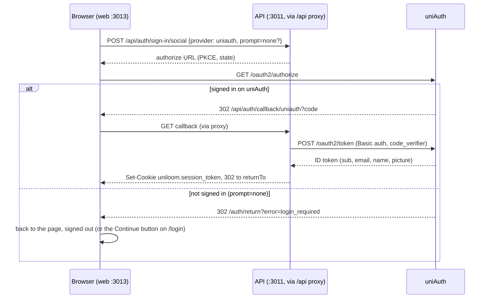
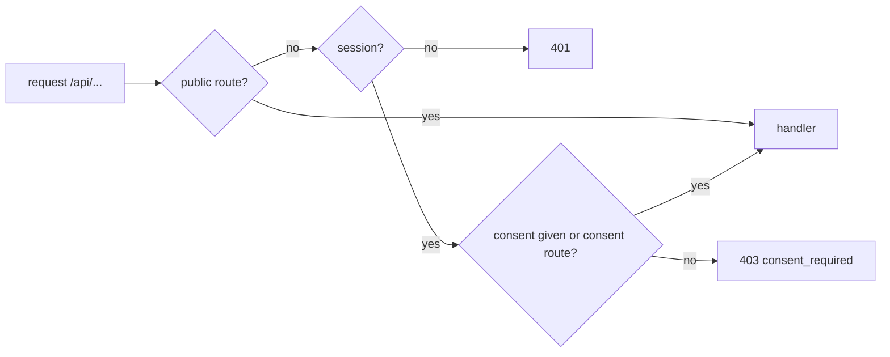
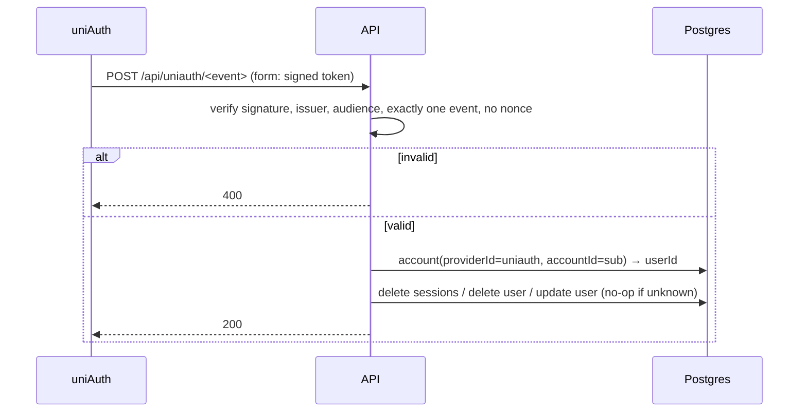

# 03: Sign-in with uniAuth

Status: In Progress

## Scope

People sign in to Uniloom with their uniAuth account, as in Unigym and as described in
uniAuth's [integration guide](https://github.com/unishare-oss/uniAuth/blob/main/docs/integrating-an-app.md)
(§3–§6). Pulled forward from feature 12 because every later feature needs a signed-in user.

**API (`apps/api`)**

- Better Auth with the uniAuth OIDC provider (`genericOAuth`, PKCE, `prompt=none` for the
  silent check), mounted at `/api/auth/*`. Uniloom keeps its own session: host-only
  `uniloom.*` cookie on the web origin, 7 days, sliding once a day. No passwords, no other
  providers.
- `session`, `account` and `verification` tables (Better Auth's shape, as Unigym), one
  migration. People are matched by uniAuth `sub` through `account`, never by email.
- Every `/api` route needs a session (401) and Uniloom's consent (403 `consent_required`),
  except health, `/api/auth/*`, the uniAuth receivers, `GET /api/me` and
  `POST /api/users/me/consent`.
- Receivers for uniAuth's server-to-server events: back-channel logout (end sessions),
  user deleted (delete the user; memberships cascade), user updated (refresh name, email,
  avatar).

**Web (`apps/web`)**

- `/login` with the silent check first, a "Continue" button otherwise; `/auth/return` for
  uniAuth errors; a silent check on any page for signed-out visitors (once per 10 minutes);
  sign-out everywhere through uniAuth's `/logout`.
- `/consent` (one-time "I agree" to Uniloom's terms), `/profile` (name, email, avatar from
  uniAuth, "Manage account" link, sign-out), draft `/terms` and `/privacy` pages.
- `proxy.ts` sends signed-out visitors on protected pages to `/login`.

**Outside this repo**

- A PR to uniAuth: Uniloom's registry entry (`apps/server/src/apps/registry.ts`) and a
  `UNILOOM_ORIGIN` env var (`config/env.ts`). Without it uniAuth won't redirect to Uniloom.
- A local uniAuth on `:3002` with a local Uniloom client, for real sign-in during
  development. Local clients get no back-channel or deletion notices (uniAuth requires
  https), so the receivers are tested with the mock provider.

Left out: dev and prod clients, sealed secrets, DNS and the k8s chart (the maintainer's
part, §7 of the guide), and any route that uses the signed-in user beyond `/api/me`.

This is above the ~8 meaningful functions per slice: it is Unigym's sign-in, ported, and
splitting API from web would leave a sign-in that can't be used.

## Done when

- [ ] Signing in at `http://127.0.0.1:3013/login` against the local uniAuth creates a
      `uniloom.session_token` cookie and `/api/me` returns the person; signing out ends it
- [x] e2e tests with a mock uniAuth cover the sign-in flow, no email/password sign-up, the
      7-day sliding session, 401 on a missing/expired/deleted session, and the consent gate
- [x] e2e tests cover the three receivers: bad token 400, unknown `sub` no-op, logout ends
      every session, deletion removes the user, accounts, sessions and memberships, update
      refreshes the copy
- [x] The event-token verifier rejects another key, wrong issuer or audience, a `nonce`, a
      second event, a missing event and garbage (unit tests)
- [x] The uniAuth PR (registry entry + `UNILOOM_ORIGIN`) is open
- [ ] `lint`, `typecheck`, `test`, `test:e2e`, `build` pass, CI included

## Design

### Functions

| Function                                                                                         | File                                                                                                                                | What                                                                                                                                             | Why                                                                                        |
| ------------------------------------------------------------------------------------------------ | ----------------------------------------------------------------------------------------------------------------------------------- | ------------------------------------------------------------------------------------------------------------------------------------------------ | ------------------------------------------------------------------------------------------ |
| `auth`                                                                                           | `apps/api/src/auth/auth.ts`                                                                                                         | Better Auth: uniAuth provider, `uniloom` cookie, 7-day sliding session, `consentGivenAt` field, empty avatar stored as null                      | One place for the sign-in rules                                                            |
| `readAuthEnv(): AuthEnv`                                                                         | `apps/api/src/auth/auth.ts`                                                                                                         | Reads `BETTER_AUTH_URL`, `BETTER_AUTH_SECRET`, `UNIAUTH_ISSUER`, `UNIAUTH_CLIENT_ID`, `UNIAUTH_CLIENT_SECRET`; throws `Missing <KEY>`            | The API refuses to start half-configured                                                   |
| `app`, `apiRoutes`                                                                               | `apps/api/src/app.ts`, `apps/api/src/routes/index.ts`                                                                               | `app` serves health and mounts `apiRoutes`, which wires `/api/auth/*`, the receivers, the session and consent middleware, and the module routers | One place shows which routes are public, need a session, or need consent                   |
| `requireSession`, `requireConsent`                                                               | `apps/api/src/auth/middleware.ts`                                                                                                   | Hono middleware: puts the session user on the context or answers 401; answers 403 `consent_required` until consent                               | Every route is protected by default, as in Unigym's two global guards                      |
| `createEventVerifier(issuer, audience, keys?)`                                                   | `apps/api/src/modules/uniauth/event-token.ts`                                                                                       | Verifies an event token against uniAuth's JWKS: issuer, audience, exactly the expected event, no `nonce`                                         | A logout token can never delete anyone, and an ID token can't pass as an event             |
| `uniauthRoutes`                                                                                  | `apps/api/src/modules/uniauth/uniauth.routes.ts`, `uniauth.handlers.ts`                                                             | `POST /api/uniauth/backchannel-logout`, `user-deleted`, `user-updated`; 400 on a bad token, 200 otherwise                                        | uniAuth tells Uniloom about logout, deletion and profile changes                           |
| `endSessions`, `deleteUser`, `updateUser`                                                        | `apps/api/src/modules/uniauth/uniauth.service.ts`, `uniauth.repository.ts`                                                          | Apply an event to the person found by `sub` through `account`; unknown `sub` is a no-op                                                          | Uniloom's copy of a person follows uniAuth                                                 |
| `userRoutes`, `toMe`, `giveConsent(userId)`                                                      | `apps/api/src/modules/users/user.routes.ts`, `user.handlers.ts`, `apps/api/src/modules/users/user.service.ts`, `user.repository.ts` | `GET /api/me`; `POST /api/users/me/consent` records the first timestamp only                                                                     | The web app needs who is signed in and a way to accept the terms                           |
| `signInWithUniauth`, `silentCheckDone`, `takeReturnTo`, `signOutEverywhere`, `uniauthAccountURL` | `apps/web/src/lib/uniauth.ts`                                                                                                       | Starts sign-in (optionally silent), remembers where it started (same origin only), signs out of uniAuth too                                      | The browser side of the guide's §4, as Unigym                                              |
| `AuthBootstrap`                                                                                  | `apps/web/src/components/auth/auth-bootstrap.tsx`                                                                                   | On every page: consent screen if needed, silent check if signed out                                                                              | "Signed in everywhere": a person signed in on another app is signed in here without a page |
| `apiFetch`                                                                                       | `apps/web/src/lib/api.ts`                                                                                                           | `fetch` that sends a `403 consent_required` to `/consent`                                                                                        | One place for the consent redirect                                                         |
| `proxy`                                                                                          | `apps/web/src/proxy.ts`                                                                                                             | Redirects signed-out visitors on protected pages to `/login?next=…`                                                                              | The API does the real check; this only avoids an empty page                                |

Pages, as in Unigym: `/login`, `/auth/return`, `/consent`, `/profile`, `/terms`, `/privacy`,
plus the `Avatar` and `LegalPage` components.

### Flows

Sign-in, including the silent check:

A protected request:

A uniAuth event:

### Notes

- **Env.** API: `BETTER_AUTH_URL` is the web origin (`http://127.0.0.1:3013` locally, a
  loopback IP because uniAuth only redirects local clients there), `BETTER_AUTH_SECRET`,
  `UNIAUTH_ISSUER`, `UNIAUTH_CLIENT_ID`, `UNIAUTH_CLIENT_SECRET`. Web:
  `NEXT_PUBLIC_UNIAUTH_URL` (build time). CI sets placeholders; e2e tests start their own
  mock uniAuth.
- **Better Auth 1.7**: callback `/api/auth/callback/uniauth`, `signIn.social`,
  `additionalParams: { prompt: 'none' }`.
- **Ported from Unigym** (`apps/api/src/auth`, `modules/uniauth`, `modules/users`,
  `test/support/mock-uniauth.ts`, and the web pages), with Nest guards and decorators
  replaced by Hono middleware and routers.
- **Deletion** removes the user; `session`, `account` and `member` rows cascade. Later
  features that add user-owned rows decide their own delete rule (authorship becomes null).
- **uniAuth registry entry:** `id: 'uniloom'`, name "Uniloom", `origin: env.appOrigins.uniloom`
  (`UNILOOM_ORIGIN`, default `http://localhost:3013`), `logoUrl: <origin>/icon.svg`,
  `defaultPath: '/'`, `allowGuests: false`, terms and privacy at `<origin>/terms` and
  `/privacy`. The web app gets a `public/icon.svg`.

## Changes

Filled in at the end.
