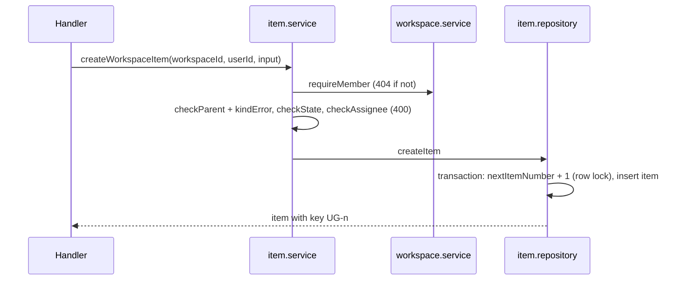
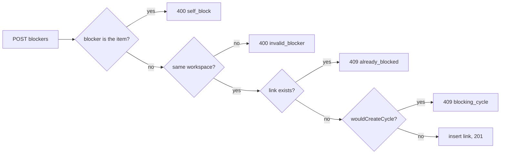

# 04: Items

Status: In Review

## Scope

Work items and their board columns (feature 3 of plan 02's order), as tables and an API.

- Tables: `state` (board columns), `item` (`<KEY>-<n>` numbers, kind, title, description,
  state, priority, assignee, parent), `item_block` (blocked-by: a many-to-many of `item`
  with itself). The missing `workspace.checklistMin` / `checklistMax` columns are added.
- Creating a workspace fills in its mode's switches and states, and makes the creator OWNER.
- API for workspaces (create, list mine) and items (list, create, get, update, delete,
  add and remove blockers). Every route needs a session, consent and membership.
- Rules: kinds and depth per mode, same-workspace references, blocked-by without self,
  duplicates or cycles.

Left out: web pages (after OpenAPI → Orval → TanStack Query), workflow gates on state
moves (checklists, designs, approval), roles beyond OWNER, invites.

## Done when

- [x] Creating a workspace adds its mode's states and switches, and makes the creator OWNER
- [x] Items get sequential `KEY-n` numbers per workspace, also under concurrent creates
- [x] Kind/parent rules per mode and blocked-by rules return the documented errors
- [x] Non-members get 404 on every workspace and item route
- [x] `lint`, `typecheck`, `test`, `test:e2e`, `build` pass, CI included

## Design

### Functions

| Function                                                                                  | File                                      | What                                                                          | Why                                                                |
| ----------------------------------------------------------------------------------------- | ----------------------------------------- | ----------------------------------------------------------------------------- | ------------------------------------------------------------------ |
| `PRESETS`                                                                                 | `modules/workspaces/workspace.presets.ts` | Switches and states per mode                                                  | A workspace's workflow comes from its mode                         |
| `createWorkspace`, `requireMember`, `isWorkspaceMember`                                   | `modules/workspaces/workspace.service.ts` | Create with preset states and owner; 404 unless a member                      | Every item route checks membership the same way                    |
| `kindError(mode, kind, parentKind)`                                                       | `modules/items/item.service.ts`           | Why a kind can't sit under a parent in a mode, or null                        | Guided is Feature → Slice, Standard is Project → Issue → Sub-issue |
| `wouldCreateCycle(links, blocked, blocker)`                                               | `modules/items/item.service.ts`           | Follows "waits on" links from the blocker back to the item                    | Items must never wait on each other in a loop                      |
| `createWorkspaceItem`, `updateWorkspaceItem`, `removeItem`, `addBlocker`, `removeBlocker` | `modules/items/item.service.ts`           | The item workflows with their checks                                          | One place for item rules, for REST now and MCP later               |
| `createItem`                                                                              | `modules/items/item.repository.ts`        | Increments `workspace.nextItemNumber` and creates the item in one transaction | The row lock gives concurrent creates distinct numbers             |
| `apiSuccess`, `apiError`, `parseBody`, `idParam`                                          | `src/http.ts`                             | The success/error envelope, zod-checked bodies, uuid path params              | Same response shape and input handling in every module             |

### Routes

| Route                                            | Answers                                                                                |
| ------------------------------------------------ | -------------------------------------------------------------------------------------- |
| `POST /api/workspaces`                           | 201 workspace; 400 `invalid_input`; 409 `key_prefix_taken`                             |
| `GET /api/workspaces`                            | the user's workspaces                                                                  |
| `GET /api/workspaces/:workspaceId/items`         | slim rows: id, key, kind, title, state, priority, assigneeId, parentId                 |
| `POST /api/workspaces/:workspaceId/items`        | 201 item; 400 `invalid_kind`, `invalid_parent`, `invalid_state`, `invalid_assignee`    |
| `GET`, `PATCH`, `DELETE /api/items/:id`          | item; `DELETE` 200 with `data: null`, or 409 `has_children`                            |
| `POST /api/items/:id/blockers`                   | 201 item; 400 `self_block`, `invalid_blocker`; 409 `already_blocked`, `blocking_cycle` |
| `DELETE /api/items/:id/blockers/:blockerId`      | 200 with `data: null`                                                                  |
| `GET /api/workspaces/:workspaceId/items/deleted` | the trash: deleted items, newest first, with `deletedAt`                               |
| `POST /api/items/:id/restore`                    | the item again, same key; 409 `parent_deleted`; 404 if not deleted                     |

Not a member, unknown id, or a malformed id: 404 `not_found` on every route.

Every answer uses the envelope from `src/http.ts`, as in Unishare: successes are
`{ success: true, message, data }` (the table shows `data`), errors are
`{ success: false, statusCode, code, message }`.

### Flows

Creating an item:

Adding a blocker:

### Notes

- `item.stateId` and `item.parentId` are `NO ACTION`: a used state or a parent with children
  can't be deleted, while deleting a workspace still cascades.
- Item kinds can't change after creation; moving an item changes its parent within the
  rules for its kind.
- `checklistMin` / `checklistMax` were missing from the workspaces migration although plan
  02 kept them; migration `workspace_checklist_limits` adds them.
- Membership is checked by an explicit `requireMember` / `loadItem` call in every item
  service function. A declarative check is recorded as
  [TD-001](../tech-debt/001-declarative-membership-check.md).
- Adding a blocker checks duplicates and cycles and inserts the link in one transaction
  with the workspace row locked, so concurrent requests can't create a loop or a 500.
  A concurrent create-under / delete of the same parent is TD-002
  ([002-parent-delete-race](../tech-debt/002-parent-delete-race.md)).
- Items can be created or moved straight into any state of their workspace. When the
  workflow gates arrive (checklists, designs, approval), they must cover create with
  `stateId` as well as `PATCH`, or creation would bypass them.
- `app.notFound` and `app.onError` keep the envelope for unknown routes and unexpected
  errors; a unique-index conflict that slips past a service check answers 409 `conflict`.
- Blocked-by is information only for now: it doesn't move items or gate state changes.
- Items are soft-deleted: `DELETE` sets `item.deletedAt` and removes the item's blocked-by
  links; the row stays. Every lookup in `item.repository.ts` skips deleted items, so they
  are 404, missing from lists, and can't be a parent or blocker. Numbers are never reused.
  A person can undo a deletion (an agent may delete the wrong item through MCP): the
  trash lists deleted items, and restore brings one back with its key and fields, not its
  old blocked-by links; a deleted parent must be restored first (409 `parent_deleted`).
  Users (uniAuth deletion, for privacy) and links are hard-deleted.

## Changes

Commits: `93131b0` (response envelope, shared test helpers), `f840993` (workspaces and
items), plus the fixes from the independent review.

- Migrations `items` (with the `item_block_not_self` CHECK), `workspace_checklist_limits`
  and `item_soft_delete`.
- `apps/api/src/modules/workspaces/*`, `apps/api/src/modules/items/*`, `apps/api/src/http.ts`,
  `apps/api/src/app.ts` (`notFound`, `onError`).
- `test/support/test-app.ts` holds the shared sign-in helpers (`startTestApi`, `read`).
- Tests: 19 unit tests for the rules; e2e for workspaces (6) and items (20).

Planned vs actual:

- Planned and built: the three tables, presets, the workspace and item routes, the kind,
  parent, state, assignee and blocked-by rules, membership on every route.
- Extra: soft delete with trash and restore (asked for during the work, so a person can
  undo an agent's delete); the `{ success, message, data }` envelope (matches Unishare);
  the `checklistMin` / `checklistMax` columns the workspaces migration had missed;
  `notFound` / `onError`.
- Changed: validation uses zod through a small `parseBody` helper instead of
  `@hono/zod-validator`; the item rules live in `item.service.ts` as planned.
- Deferred: the parent delete race (TD-002); a declarative membership check (TD-001).
