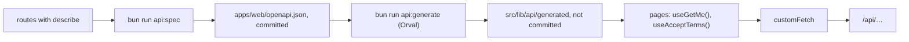

# 05: Typed API client (OpenAPI → Orval → TanStack Query)

Status: In Progress

## Scope

The web app calls the API through generated, typed hooks instead of hand-written `fetch`,
as in Unishare: the API publishes an OpenAPI spec, Orval turns it into TypeScript functions
and TanStack Query hooks, and pages use those hooks.

- API: every web-facing route describes itself (`describe()` in `src/openapi.ts`);
  `bun run api:spec` writes `apps/web/openapi.json`; `/api/openapi.json` and `/api/docs`
  (Scalar) serve it.
- Web: Orval config, Unishare's fetcher (plus the error `code`), a `QueryClientProvider`
  and toasts (sonner); `/profile` and `/consent` use the generated hooks.
- CI: fails when the committed spec is stale; generates the client before lint, typecheck
  and build. The generated client is not committed.

Left out: success toasts (the fetcher exposes the message; pages add toasts when they need
them), documenting error responses per route (they share one shape, described in the
spec's info).

## Done when

- [x] `bun run api:spec` writes an OpenAPI 3.1 spec covering the 13 routes, and `/api/docs`
      shows it
- [x] `bun run api:generate` produces typed functions and TanStack hooks; `/profile` and
      `/consent` use them
- [x] Successes return `{ data, message, status, headers }`; failed calls throw `ApiError`
      with message, code and status; `consent_required` still redirects
- [x] CI fails when `openapi.json` is stale, and generates the client before
      lint/typecheck/build
- [ ] `lint`, `typecheck`, `test`, `test:e2e`, `build` pass, CI included (local checks
      pass; CI runs once the branch is pushed)

## Design

| Function             | File                                    | What                                                                             | Why                                                                      |
| -------------------- | --------------------------------------- | -------------------------------------------------------------------------------- | ------------------------------------------------------------------------ |
| `describe(route)`    | `apps/api/src/openapi.ts`               | `describeRoute` with tag, `operationId`, path params, body and the `data` schema | 13 routes describe themselves the same way; `operationId` names the hook |
| `specOptions`        | `apps/api/src/openapi.ts`               | OpenAPI 3.1 document info; excludes sign-in, uniAuth, health, docs               | Shared by the served spec and the generator, so they can't differ        |
| `scripts/openapi.ts` | `apps/api/scripts/openapi.ts`           | Imports the app with placeholder settings and writes the spec                    | Generating needs no database or uniAuth                                  |
| `customFetch`        | `apps/web/src/lib/api/fetcher.ts`       | Orval's mutator: `{ data, message, status, headers }` or throws `ApiError`       | One place for the envelope, errors and the consent redirect              |
| `ApiError`           | `apps/web/src/lib/api/fetcher.ts`       | `message`, `status`, `code` of a failed call                                     | Pages show `message` and branch on `code`                                |
| `Providers`          | `apps/web/src/components/providers.tsx` | `QueryClientProvider` and the toaster                                            | Every page can use hooks and toasts                                      |

Flow:

### Notes

- The spec documents the `data` inside `{ success, message, data }`; the fetcher returns
  `{ data, message, status, headers }`. Queries take the data with
  `select: (r) => r.data`; mutations get the message in `onSuccess`.
- Orval's response types don't include `message` (as in Unishare); add a typed accessor
  the first time a page shows a success toast.
- `apps/web/openapi.json` is in `.prettierignore`: CI compares it byte for byte with the
  generator's output.
- The web `dev` and `build` scripts generate the client first, so Docker needs no extra step.

## Changes

To fill in when the work is committed.
