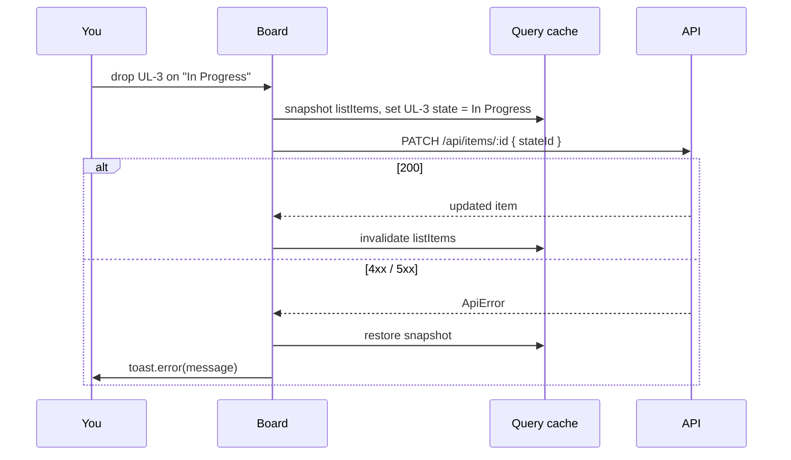

# 06: Web pages for workspaces and items

Status: In Progress

## Scope

Pages for what the API already does (plans 02 and 04), through the generated hooks
(plan 05). Part of `MVP.md` §14 step 8, pulled forward to use what is built so far.

- `/`: when signed in, your workspaces and a "New workspace" form (name, key prefix,
  mode). Signed out, the current landing page.
- `/w/[workspaceId]`: the board, one column per state in board order, item cards (key,
  title, kind, priority). **Drag a card to another column to change its state.**
  "New item" form. A search box filters the loaded cards by key or title (no API call).
- `/w/[workspaceId]/items/[itemId]`: the item: edit title, description, state, priority
  and parent; blocked-by list (add by key, remove); delete. The description is shown
  rendered (Markdown with GitHub extras and Mermaid diagrams); **Edit** opens a text box
  with Write / Preview tabs and Save / Cancel.
- `/w/[workspaceId]/trash`: deleted items, each with Restore.
- API: `GET /api/workspaces/:workspaceId` returns the workspace with its states, which
  the board needs for empty columns and the item page for its state picker.
- Polished with shadcn components: a sidebar (workspaces, the open one's Board and
  Trash, New workspace, Profile) that becomes a slide-out menu on phones, empty states,
  loading skeletons, error toasts, works at phone width.
- Look: dense and clean like Jira, in Uniloom's own details: white, slate text `#0F172A`,
  one blue `#2563EB` for actions and selection, uppercase status lozenges, signal-bar
  priority icons, Uniloom's own type icons (Feature: woven grid on `#C2410C`; Slice:
  thread on `#0F766E`), Geist and Geist Mono (`next/font`). The sidebar and workspace cards take
  UniShare's style: 2px dark outline, solid offset shadow, rounded corners, spaced
  uppercase section labels (Primary, the open workspace, Switch to); the active link is a
  filled blue block. Texture and accent (option B on the canvas): a faint dot grid behind
  the board, a 3px top on each column in its state's colour (Blocked red, In Review amber,
  Done green, …). Colours live only in shadcn's
  CSS variables in `globals.css`: light under `:root`, dark (neutral greys, not blue-tinted) under `.dark`. The
  theme follows the system setting, with a Light / Dark / System switch on `/profile`.
- Design mockups, light and dark: https://claude.ai/artifact/8ESvEVsPi9pQChCusHf2vq

Left out: labels, checklist, comments (plan 07), mode rules (plan 08), assignee picker
(needs members, §14 step 6), reordering cards inside a column (items have no position).

## Done when

- [x] `GET /api/workspaces/:workspaceId` returns the workspace and its states in board
      order; non-members get 404 (e2e)
- [ ] A signed-in user sees their workspaces on `/` and can create one
- [ ] The board shows every state as a column, and dragging a card (mouse, touch or
      keyboard) to another column changes its state, undone with a toast if the API refuses
- [ ] The item page edits title, description, state, priority, parent and blocked-by, and
      deletes the item; a blocked-by cycle shows the API's message
- [ ] The trash lists deleted items and Restore brings one back to the board
- [ ] A description renders Markdown (tables, task lists, code) and ```mermaid blocks as
      diagrams, never raw HTML; Mermaid loads only when a description has a diagram

## Design

| Function                 | File                                                              | What                                                                                  | Why                                                                   |
| ------------------------ | ----------------------------------------------------------------- | ------------------------------------------------------------------------------------- | --------------------------------------------------------------------- |
| `getWorkspace`           | `apps/api/src/modules/workspaces/workspace.*.ts`                  | Route + handler + service (`requireMember`) + repository with states                  | The board can't draw empty columns from the items alone               |
| `WorkspaceList`          | `apps/web/src/components/workspaces/workspace-list.tsx`           | `useListWorkspaces`, cards linking to boards, `NewWorkspaceDialog`                    | Entry point after sign-in                                             |
| `Board`                  | `apps/web/src/components/board/board.tsx`                         | `useGetWorkspace` + `useListItems`, groups items by state, `DndContext`               | One page holds the drag state and the update                          |
| `moveItem`               | `apps/web/src/components/board/board.tsx`                         | `onDragEnd`: optimistic cache update, `useUpdateItem({ stateId })`, rollback on error | The card moves at once; a refusal puts it back                        |
| `BoardColumn`/`ItemCard` | `apps/web/src/components/board/board-column.tsx`, `item-card.tsx` | `useDroppable` column, `useDraggable` card (a link to the item page)                  | Plain dnd-kit, no sortable layer: no order inside columns             |
| `ItemPage`               | `apps/web/src/components/items/item-detail.tsx`                   | Form for the fields, blocked-by list, delete with confirm                             | Everything `PATCH`, blockers and delete allow                         |
| `Trash`                  | `apps/web/src/components/items/trash.tsx`                         | `useListDeletedItems`, Restore per row                                                | Soft delete is only useful if you can undo it                         |
| `Markdown`               | `apps/web/src/components/markdown/markdown.tsx`                   | `react-markdown` + `remark-gfm`; ```mermaid code blocks go to `Mermaid`               | One renderer, reused by designs (§14 step 7) and slice pages (step 9) |
| `Mermaid`                | `apps/web/src/components/markdown/mermaid.tsx`                    | `import('mermaid')` on first use, `securityLevel: 'strict'`, theme from light/dark    | About 500 KB, so only pages with a diagram pay for it                 |

### Drag and drop

`@dnd-kit/core` (no `@dnd-kit/sortable`): columns are droppable (id = state id), cards
are draggable (id = item id). Its sensors give mouse, touch and keyboard (Space to pick
up, arrows, Space to drop) with screen-reader announcements; native HTML drag and drop
has no touch or keyboard support. A small activation distance keeps a click on a card
opening the item instead of starting a drag.



Today the API accepts any move; once the rules engine lands (plan 08), a refused move
("tick every done-when item first") uses this same rollback path.

## Changes

To fill in when the work is committed.
