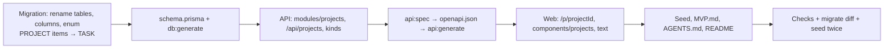

# 07: Workspaces become projects; Standard is Task → Subtask

Status: Done

## Scope

A rename, before the MCP server (§14 step 4) makes the names public. Reasons in
[ADR-0006](../adr/0006-projects-tasks-subtasks.md).

- **Workspace → Project** everywhere: database tables and columns, API routes and
  fields, the web's URLs and text, the seed and the docs. A project keeps everything a
  workspace had: name, key prefix (`FYP-12`), mode, switches, states, members.
- **Standard kinds become Task → Subtask.** The `PROJECT` item kind goes, since the
  project is now the container. A task has no parent; a subtask belongs to a task.
  Guided stays Feature → Slice.
- **Existing data is kept:** one migration renames tables, columns, enums and their
  constraints, and turns `PROJECT` items into tasks (their tasks lose that parent).
- The API: `/api/projects`, `/api/projects/:projectId`, `/api/projects/:projectId/items`,
  `/api/projects/:projectId/trash`; responses say `projectId`. Error codes stay.
- The web: `/p/[projectId]`, `/p/[projectId]/items/[itemId]`, `/p/[projectId]/trash`;
  "New project", "Your projects", "Switch to" and so on.

Left out: milestones (post-MVP, see `MVP.md` §16), redirects from the old `/w/...` URLs
(nothing is deployed yet), and editing old plans and ADRs (they record what was true then;
ADR-0006 points out the rename).

## Done when

- [x] One migration renames `workspace` to `project` (table, columns, enum, indexes and
      constraints), keeps every row, and `prisma migrate diff` shows the schema matches
- [x] Standard items are `TASK` or `SUBTASK` only: old `PROJECT` items are tasks, creating
      a `PROJECT` item is refused with 400, and a subtask still needs a task (unit + e2e)
- [x] The API serves `/api/projects/...` with `projectId` in every route, schema and
      `openapi.json`; non-members still get 404 (e2e)
- [x] The web serves `/p/[projectId]` (board, item, trash) and its text says project,
      task and subtask, never workspace or issue
- [x] The seed, `MVP.md`, the three `AGENTS.md` files and `README.md` use project, task and
      subtask; `bun run db:seed` runs twice in a row
- [x] `lint`, `typecheck`, `test`, `test:e2e`, `build` pass, CI included

## Design

Mostly mechanical renames; only the migration needs care.

| Function / file                                   | What                                                                                                                                                                                                                                                                                   | Why                                                                                                                                  |
| ------------------------------------------------- | -------------------------------------------------------------------------------------------------------------------------------------------------------------------------------------------------------------------------------------------------------------------------------------- | ------------------------------------------------------------------------------------------------------------------------------------ |
| `prisma/migrations/<ts>_projects/migration.sql`   | Hand-written: `ALTER TABLE ... RENAME` for the table and every `workspaceId` column, `ALTER INDEX`/`RENAME CONSTRAINT` for each name Prisma derives from them, `ALTER TYPE "WorkspaceMode" RENAME TO "ProjectMode"`; `PROJECT` items → `TASK`, then the enum rebuilt without `PROJECT` | Prisma's generated diff would drop and recreate the tables and lose data. Renames keep rows; checking `migrate diff` proves no drift |
| `schema.prisma`                                   | `Project`, `ProjectMode`, `projectId`, `@@map("project")`; `ItemKind` without `PROJECT`                                                                                                                                                                                                | The model says what the product calls it                                                                                             |
| `ALLOWED_PARENTS` (`item.service.ts`)             | `STANDARD: { TASK: [null], SUBTASK: ['TASK'] }`                                                                                                                                                                                                                                        | Two levels, like Guided                                                                                                              |
| `modules/projects/*` (was `modules/workspaces/*`) | Same routes, handlers, service, repository and presets, renamed: `createProject`, `requireMember(projectId, …)`, `PRESETS`                                                                                                                                                             | Module name matches its routes (ADR-0004)                                                                                            |
| `apps/web/src/app/p/[projectId]/*`                | Board, item and trash routes, moved from `w/[workspaceId]`                                                                                                                                                                                                                             | URL matches the name                                                                                                                 |
| `apps/web/src/components/projects/*`              | `ProjectList`, `NewProjectDialog`, `ProjectChip` (were `workspaces/*`); sidebar and proxy updated                                                                                                                                                                                      | Same reason                                                                                                                          |

Order of work: API and database first (then `api:spec` and `api:generate`), then the web
against the new client, then docs and the seed. Two Sonnet subagents, one after the other
on the same branch: the web one needs the API's new spec.

## Changes

Commits: `cc3ece5` (rename), `f12f898` (seed), on branch `feat/projects-and-tasks`, PR #12. Done by two Sonnet subagents (API and database, then web
and docs), reviewed and checked by the main agent.

- Two migrations: `20261005120000_task_kinds` renames `ISSUE`/`SUB_ISSUE` to
  `TASK`/`SUBTASK` (a first step, before the container rename was decided), and
  `20261005140000_projects` renames the table, columns, enum, keys and indexes, turns
  `PROJECT` items into tasks and rebuilds `ItemKind` without `PROJECT`. Applied to the dev
  database; `prisma migrate diff` against it is empty.
- API: `modules/workspaces` → `modules/projects` (`createProject`, `getProject`,
  `requireMember`, `isProjectMember`); routes under `/api/projects`; `projectId` in every
  response; messages say project, error codes unchanged. `ALLOWED_PARENTS.STANDARD` is
  `{ TASK: [null], SUBTASK: ['TASK'] }`. New e2e: a `PROJECT` item is refused with 400.
- Web: routes moved to `/p/[projectId]` (board, item, trash); `components/projects/*`
  (`ProjectList`, `NewProjectDialog`, `ProjectChip`); sidebar, proxy, dialogs and copy say
  project, task and subtask.
- Seed (`bun run db:seed`, `apps/api/scripts/seed.ts`) with test projects TG, TS, TR and
  TX; ran twice in a row. AGENTS.md: plans add their cases to the seed.
- Docs: `MVP.md` (projects, Task → Subtask, milestones as §16 item 7), app `AGENTS.md`
  files, `README.md`, ADR-0003 kinds paragraph, ADR-0006 (Proposed).

Checks: lint, typecheck, build pass; API unit 35/35 and e2e 68/68 pass against the dev
database; CI passes on PR #12.

Planned vs actual:

- The trash route kept its existing path, `/api/projects/:projectId/items/deleted`, not
  `/trash` as the scope said.
- The `--project` colour token stays: the landing page still uses it.
- Parent pickers on the web still list every item and rely on the API to refuse a wrong
  kind, as before (the rule lives in the API).
- Not checked in a browser yet.
