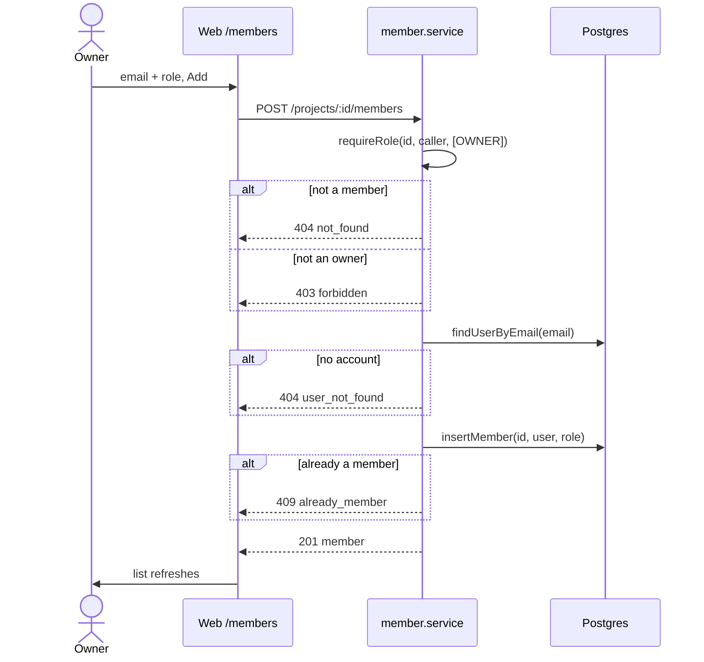
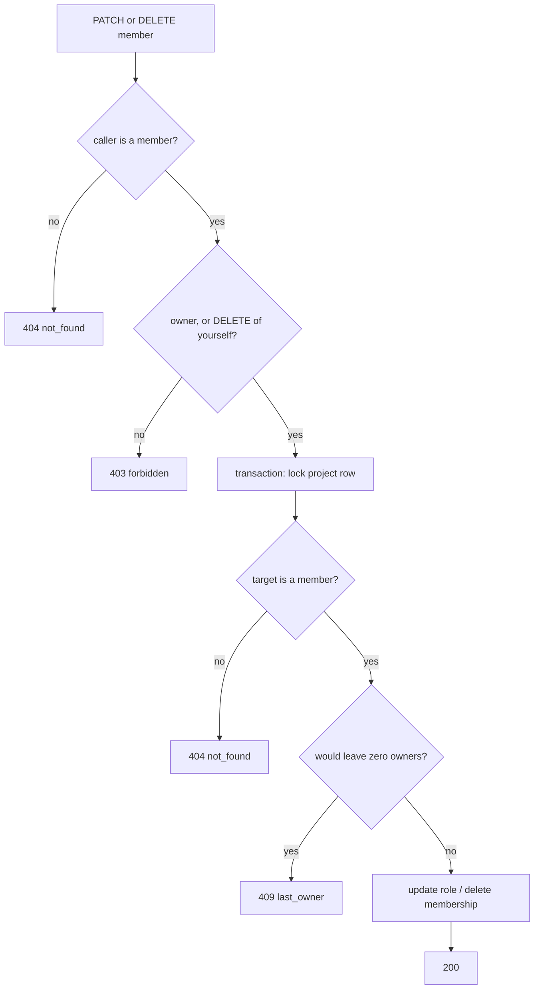

# 08: Members and roles

Status: In Review

## Scope

The first half of MVP §14 step 6 ("Users and roles"), following §4. It covers who belongs to a
project and with which role, and lets the owner manage that:

- See a project's members and their roles (any member).
- Add someone who already has a Uniloom account, by email, with a role (owner only).
- Change a member's role, or remove a member (owner only). Anyone can leave a project.
- A project always keeps at least one owner.
- A web page, `/p/[projectId]/members`, for all of the above.
- One role check in the API, `requireRole`, that REST routes use now and MCP tools will
  use later.

Left out:

- **Invites** for people without an account yet (email or link, and accepting one). That
  is the next plan, with the `invite` table from plan 02.
- **Reviewer-only actions** such as approving designs, accepting ADRs and moving items to
  Done. Those rules come with designs (step 7) and the rules engine (step 3), and will use
  `requireRole`.
- **Approver ≠ author**, which needs designs.
- **Owner-only project settings** (key prefix, mode, switches). No route changes them
  yet.

## Done when

- [x] `GET /projects/:projectId/members` lists every member with name, email, image
      and role. Non-members get 404, and `GET /projects/:projectId` returns the
      caller's `role` and `canManageMembers`.
- [x] An owner can add a user by email with a role: `404 user_not_found` when no account
      has that email, `409 already_member` when they already belong. Reviewers and members
      get `403 forbidden`.
- [x] An owner can change a member's role and remove a member. Any member can remove
      themselves (leave). Demoting or removing the last owner gets `409 last_owner`, checked
      with the project row locked so two requests can't both pass.
- [x] `/p/[projectId]/members` shows the list. Owners get the add form, a role picker and
      Remove on each row; everyone gets Leave project. The sidebar links to it.
- [x] e2e tests cover each answer above (404 non-member, 403 non-owner, 404/409 on add,
      409 last owner, leave), and the new routes are in the "non-member gets 404 on every
      route" test.

## Design

A new API module, `apps/api/src/modules/members/`, laid out like `projects/`
([ADR-0004](../adr/0004-api-feature-modules.md)). Routes are nested under
`/projects/:projectId/members`.

| Function                                                       | File                                               | What                                                                                                                                                | Why                                                                                                                                                                                              |
| -------------------------------------------------------------- | -------------------------------------------------- | --------------------------------------------------------------------------------------------------------------------------------------------------- | ------------------------------------------------------------------------------------------------------------------------------------------------------------------------------------------------ |
| `requireRole(projectId, userId, roles)`                        | `members/member.service.ts`                        | Returns the caller's membership. Throws 404 if they aren't a member, and 403 `forbidden` if their role isn't in `roles`.                            | The one role check. Every owner-only action calls it, and later Reviewer-only actions and MCP tools will too. Like `requireMember` (TD-001), it lives in the service so MCP gets the same check. |
| `listMembers(projectId, userId)`                               | `members/member.service.ts`                        | `requireRole` with any role, then the members with their user's name, email and image, owners first.                                                | Done-when 1: the members page and, later, the assignee picker.                                                                                                                                   |
| `addMember(projectId, userId, { email, role })`                | `members/member.service.ts`                        | Owner only. Looks up the user by email (`404 user_not_found`) and inserts the membership (`409 already_member` on the unique key).                  | Done-when 2. Adding by email only works for people who have signed in to Uniloom once; invites cover everyone else.                                                                              |
| `changeRole(projectId, userId, targetId, role)`                | `members/member.service.ts`                        | Owner only. Calls `updateRoleKeepingOwner`.                                                                                                         | Done-when 3.                                                                                                                                                                                     |
| `removeMember(projectId, userId, targetId)`                    | `members/member.service.ts`                        | Allowed for an owner, or when `targetId` is the caller (leave). Calls `deleteKeepingOwner`.                                                         | Done-when 3. Leaving needs no owner, otherwise members could never leave.                                                                                                                        |
| `updateRoleKeepingOwner` / `deleteKeepingOwner`                | `members/member.repository.ts`                     | In one transaction: lock the project row (as `createItem` does), count owners, refuse with `last_owner` if the change would leave none, then write. | Done-when 3. Two owners demoting each other at the same moment must not leave the project ownerless.                                                                                             |
| `findMembers`, `findMember`, `findUserByEmail`, `insertMember` | `members/member.repository.ts`                     | Plain Prisma reads and writes.                                                                                                                      | Used by the service functions above.                                                                                                                                                             |
| `getProject` (changed)                                         | `projects/project.service.ts`                      | Also returns the caller's `role` and `canManageMembers` (`role === 'OWNER'`).                                                                       | Done-when 1. The web app shows owner controls from this flag instead of repeating the rule (AGENTS.md: rules live in the API).                                                                   |
| `MembersPage`                                                  | `apps/web/src/components/members/members-page.tsx` | The list, plus the owner controls when `canManageMembers` is true, using the Orval hooks. Errors show `err.message` in a toast.                     | Done-when 4.                                                                                                                                                                                     |

Routes:

| Method and path                                         | Who                | Main errors                                     |
| ------------------------------------------------------- | ------------------ | ----------------------------------------------- |
| `GET /projects/:projectId/members`                      | any member         | 404                                             |
| `POST /projects/:projectId/members` `{ email, role }`   | owner              | 403, 404 `user_not_found`, 409 `already_member` |
| `PATCH /projects/:projectId/members/:userId` `{ role }` | owner              | 403, 404, 409 `last_owner`                      |
| `DELETE /projects/:projectId/members/:userId`           | owner, or yourself | 403, 404, 409 `last_owner`                      |

### Add a member

### Change a role or remove (keeping an owner)

### Notes

- Roles stay the `Role` enum from plan 02. No migration is needed: `member` already has
  everything this plan uses.
- A removed member's items, and their assignee field, are left as they are. Reassigning
  is a later concern.
- Owners can make other people owners. There is no single "the owner".
- Decision (user): a sole owner must make someone else an owner before leaving. Leaving
  as the last owner answers `409 last_owner` with that hint. If the owner is the only
  member they can't leave at all (nobody to hand over to, and there is no delete-project
  yet); the same 409 covers it.

## Changes

Built on `dev` as "workspace", then moved onto `dev` after the rename to "project" (PR #12,
plan 07 projects and tasks). This plan moved from 07 to 08 because 07 was taken.

- API: new module `apps/api/src/modules/members/` (routes, handlers, service, repository,
  schema), as in the design. `requireRole` is a plain service function. The last-owner check
  runs in one transaction that locks the project row (`keepingOwner` in the repository,
  shared by the role change and the removal). `getProject` now returns `role` and
  `canManageMembers`. Routes are mounted in `routes/index.ts`, and `openapi.json` is
  regenerated.
- Web: `/p/[projectId]/members` (`components/members/members-page.tsx`) and a Members
  link in the sidebar. Owner controls show only from `canManageMembers`. Errors show
  `err.message` in a toast, so `last_owner` shows the API's hint to hand over ownership.
- Tests: `test/members.e2e-spec.ts`, plus the new operation ids in `app.e2e-spec.ts`. All 79
  e2e tests pass against the dev database.
- Planned vs actual: built as planned, plus the user's rule that a sole owner must make
  someone else an owner before leaving (the `last_owner` message says so), with an e2e case
  for it. No migration. The workspace → project rename was applied to everything above.
