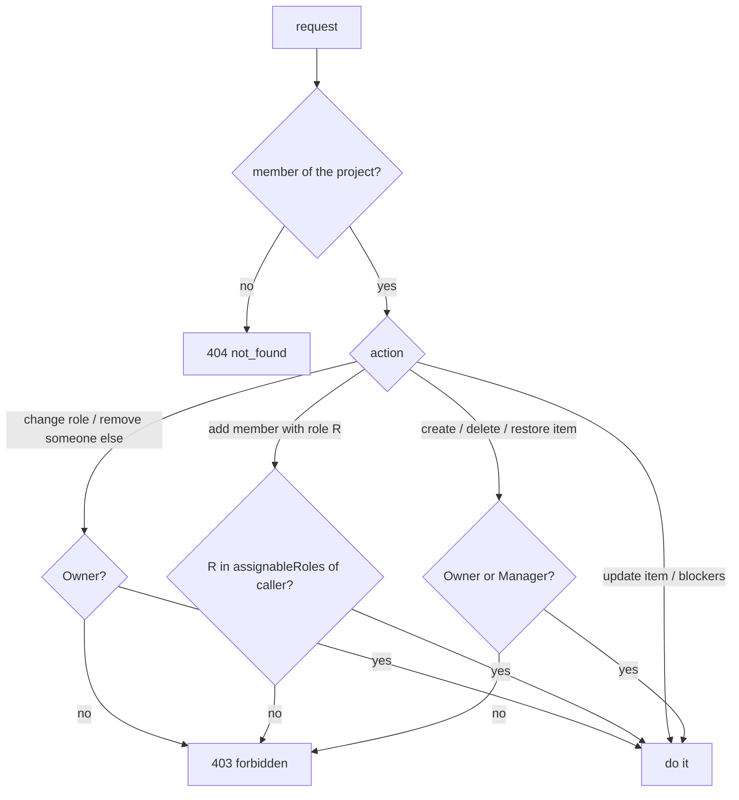

# 09: Manager role and who can create work

Status: Done

## Scope

Changes the roles from plan 08 as decided in [ADR-0007](../adr/0007-manager-role.md):
Reviewer becomes **Manager**, and only Owners and Managers create or delete work.

- Rename the role `REVIEWER` to `MANAGER`, in the database and everywhere it is written.
- A Manager can add members, but only with the role Member.
- Creating, deleting and restoring tickets and subtasks needs Owner or Manager.
- Members still move tickets across states, edit them, set blockers and comment.
- The web app hides what a role can't do, from flags the API returns.
- `MVP.md` §4 says the same.

Left out:

- **The review actions** themselves (approve a design → Ready, accept an ADR, move to
  Done). They come with designs (step 7) and the rules engine (step 3), and will check
  Owner or Manager with `requireRole`.
- **Deleting a project.** There is no route yet. When it comes, it is Owner-only.
- **Editing only your own tickets.** Members can edit any ticket in the project, as now.

## Done when

- [x] The `Role` enum value `REVIEWER` is renamed to `MANAGER` by a migration (existing
      rows become managers). The API and web use one role list instead of four copies.
- [x] A Manager can `POST /projects/:projectId/members` with `role: MEMBER`; any other
      role gets `403 forbidden`. Changing roles and removing other people stay Owner-only.
- [x] Creating, deleting or restoring an item needs Owner or Manager: a Member gets
      `403 forbidden`. A Member can still update an item's state, fields and blockers.
- [x] `GET /projects/:projectId` returns `canCreateItems` and `assignableRoles`. Members
      see no New item, Add subtask, Delete or Restore. A Manager sees the add-member form
      with the role fixed to Member, and no role picker or Remove.
- [x] e2e tests cover each answer above, and the seed has a project where you are a
      Manager and one where you are a Member, with item titles that say what to try.
- [x] `MVP.md` §4 shows the Owner / Manager / Member table from ADR-0007, and "reviewer"
      reads "manager" in the rest of the spec.

## Design

| Function                                                          | File                          | What                                                                                                                       | Why                                                                                                                 |
| ----------------------------------------------------------------- | ----------------------------- | -------------------------------------------------------------------------------------------------------------------------- | ------------------------------------------------------------------------------------------------------------------- |
| migration `rename_reviewer_to_manager`                            | `prisma/migrations/`          | `ALTER TYPE "Role" RENAME VALUE 'REVIEWER' TO 'MANAGER'`.                                                                  | Done-when 1. Renaming the value keeps every existing row; no data copy.                                             |
| `ROLES`, `CREATORS`                                               | `members/member.service.ts`   | `ROLES` is every role, from the Prisma `Role` enum. `CREATORS` is `[OWNER, MANAGER]`.                                      | Done-when 1 and 3. One list, used by the zod schemas and by `requireRole`, instead of four copies.                  |
| `assignableRoles(role)`                                           | `members/member.service.ts`   | Owner → every role. Manager → `[MEMBER]`. Member → none.                                                                   | Done-when 2 and 4. The one place that says who may give which role; `addMember` and `getProject` both use it.       |
| `addMember` (changed)                                             | `members/member.service.ts`   | `requireRole` with `CREATORS`, then `403 forbidden` if `input.role` isn't in `assignableRoles(caller.role)`.               | Done-when 2.                                                                                                        |
| `createProjectItem`, `removeItem`, `restoreProjectItem` (changed) | `items/item.service.ts`       | Call `requireRole(projectId, userId, CREATORS)` instead of `requireMember`.                                                | Done-when 3. In the service, so MCP tools get the same rule. `updateProjectItem` and blockers keep `requireMember`. |
| `getProject` (changed)                                            | `projects/project.service.ts` | Also returns `canCreateItems` (role in `CREATORS`) and `assignableRoles`.                                                  | Done-when 4. The web shows controls from these flags instead of repeating the rules (AGENTS.md).                    |
| `MembersPage`, `NewItemDialog`, board, item detail, trash         | `apps/web/src/components/`    | Hide New item, Add subtask, Delete and Restore when `!canCreateItems`. The add form offers `assignableRoles` only.         | Done-when 4.                                                                                                        |
| `seedManager`, `seedMember`                                       | `scripts/seed.ts`             | `seedReviewer` becomes `seedManager` (`TR` → "Seed · Manager"); a new `TM` "Seed · Member" project where you are a Member. | Done-when 5. One project per role, so each rule can be tried by hand.                                               |

Routes that change who may call them:

| Method and path                     | Before     | After                                                         | Errors   |
| ----------------------------------- | ---------- | ------------------------------------------------------------- | -------- |
| `POST /projects/:projectId/members` | owner      | owner (any role), manager (`MEMBER` only)                     | 403      |
| `POST /projects/:projectId/items`   | any member | owner, manager                                                | 403      |
| `DELETE /items/:id`                 | any member | owner, manager                                                | 403, 409 |
| `POST /items/:id/restore`           | any member | owner, manager                                                | 403, 409 |
| `GET /projects/:projectId`          | any member | same, plus `canCreateItems` and `assignableRoles` in the body | 404      |

### Who may do what

### Notes

- Decision (user): Manager replaces Reviewer and keeps its review actions; Managers add
  people as Member only; Members move and edit tickets but don't create or delete them.
- A Member's agent acts as that Member (MVP §4), so over MCP it can't create tickets
  either. The user confirmed this.
- Built on `feat/members-and-roles-impl` (PR #13), since it changes plan 08's code.

## Changes

Commits: none yet (nothing is committed or pushed; the work sits uncommitted on `feat/manager-role`).

What changed and how:

- **Migration** `20261005160000_rename_reviewer_to_manager` renames the enum value; applied to the dev database with `bun run --cwd apps/api db:deploy`. `schema.prisma` and the Prisma client follow.
- **One role list.** `member.service.ts` exports `ROLES` (`Object.values(Role)` from the generated enum), `CREATORS` and `assignableRoles(role)`. Both zod schemas use `z.enum(Role)`; `getProject` uses `ROLES`. The web has no role list: the member rows' role picker and the add form use `assignableRoles` from `GET /projects/:projectId`, and its `Role` type comes from the generated client.
- **API rules.** `addMember` calls `requireRole(CREATORS)` and then 403s a role outside `assignableRoles(caller.role)`. `createProjectItem`, `removeItem` and `restoreProjectItem` call `requireRole(CREATORS)`. `getProject` also returns `canCreateItems` and `assignableRoles`. `openapi.json` and the Orval client regenerated.
- **Web.** Board hides New item, item detail hides the Delete card, trash hides Restore when `!canCreateItems`. The members page shows the add form when `assignableRoles` is not empty: a role picker for an owner, the fixed text "Member" for a manager; role pickers on rows and Remove stay owner-only (`canManageMembers`).
- **Tests.** `members.e2e-spec.ts` covers the flags per role, manager adds Member only (403 otherwise), owner-only role change and removal, and a manager leaving. `items.e2e-spec.ts` has a `roles` block: manager creates, deletes and restores; member gets 403 on each; member still updates state and fields and sets blockers. `app.e2e-spec.ts` needed no change (the operation list is the same).
- **Seed.** `seedReviewer` is now `seedManager` (`TR`, "Seed · Manager", you are MANAGER) and `seedMember` adds `TM` "Seed · Member" (you are MEMBER). Ko's items in TR no longer use `by: ko`, since a member can't create. Not run against the dev database.
- **Docs.** `MVP.md` §4 has the ADR-0007 table and "reviewer" reads "manager" elsewhere (Prettier re-aligned the tables); `README.md` seed line updated.

Planned vs actual: as planned. The plan lists "Add subtask" among controls to hide, but the web has no such button yet (subtasks are made from New item), so only New item, Delete and Restore were gated.

Checks: `bun run lint`, `typecheck`, `test` (35 unit) and `build` pass; `test:e2e` passes (83 tests, against the dev database).
