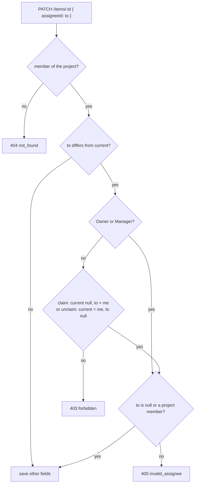
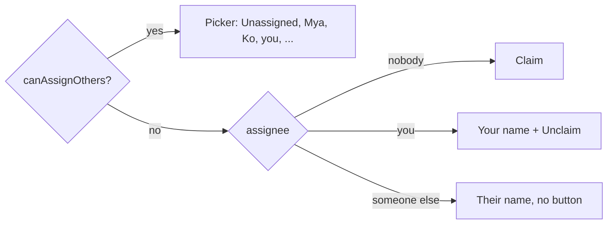

# 10: Assign and claim tickets

Status: In Review

## Scope

Who may set a ticket's assignee (`MVP.md` §3 "Assignee: one user"), following the roles in
[ADR-0007](../adr/0007-manager-role.md). Items already have `assigneeId`, and the API
checks the assignee is a project member, but anyone in the project can assign anyone and
the web has no assignee field.

- **Owners and Managers** assign any project member (Owners included), reassign, unassign,
  or take a ticket themselves.
- **Members** can only **claim** an unassigned ticket (assign themselves) or **unclaim**
  one assigned to them. They can't assign someone else or take a ticket someone else has.
- No mode on the ticket: a ticket is open to claim when its assignee is empty. Creating
  one with no assignee is "self-claim"; picking someone is "assign".
- The web shows an Assignee field on the item page and in the New item dialog, and the
  assignee's avatar on board cards.

Left out:

- **A project switch that turns self-claim off.** Add it to the rules engine (§14 step 3)
  if a project needs only Owners and Managers to assign.
- **Board filter by assignee** (§10 Board). A later web slice.
- **MCP claim tools.** They come with the MCP server (§14 step 4) and call the same
  service rule.
- **Notifications** when you're assigned.

## Done when

- [x] `PATCH /items/:id` with a new `assigneeId`: a Member may only claim an unassigned
      ticket or unclaim their own, anything else is `403 forbidden`; Owners and Managers
      may set any project member or null; a non-member stays `400 invalid_assignee`
      (unit tests for the rule, e2e for each role)
- [x] `GET /projects/:projectId` returns `canAssignOthers` (Owner, Manager)
- [x] The item page sidebar shows **Assignee**: Owners and Managers get a picker
      (Unassigned + every member); a Member sees who has it, with **Claim** when it's
      free and **Unclaim** when it's theirs
- [x] The New item dialog has an optional Assignee picker, Unassigned by default
- [x] Board cards show the assignee's avatar (name on hover and for screen readers)
      instead of the yes/no icon
- [x] The seed has a ticket per case, with titles that say what to try and what happens
      (claim a free one, unclaim yours, try to take Mya's → refused)

## Design

| Function                             | File                                | What                                                                                                                                                                                    | Why                                                                                                      |
| ------------------------------------ | ----------------------------------- | --------------------------------------------------------------------------------------------------------------------------------------------------------------------------------------- | -------------------------------------------------------------------------------------------------------- |
| `mayAssign(role, userId, from, to)`  | `items/item.service.ts`             | Pure: true for Owner and Manager; for Member only when `from` is null and `to` is `userId` (claim) or `from` is `userId` and `to` is null (unclaim).                                    | Done-when 1. One place that states the rule; unit-tested without a database. MCP tools will call it too. |
| `updateProjectItem` (changed)        | `items/item.service.ts`             | When `input.assigneeId` is set and differs from the current one: `requireRole(..., ROLES)` for the caller's role, then `403 forbidden` unless `mayAssign`. Then `checkAssignee` as now. | Done-when 1. Only an assignee change needs the role; other edits stay open to any member.                |
| `createProjectItem`                  | `items/item.service.ts`             | Unchanged: only Owners and Managers create, and they may assign anyone.                                                                                                                 | No new rule needed on create.                                                                            |
| `getProject` (changed)               | `projects/project.service.ts`       | Also returns `canAssignOthers: CREATORS.includes(role)`.                                                                                                                                | Done-when 2. The web shows the picker or the Claim button from the flag, never from its own rule.        |
| `AssigneeField`                      | `web/.../items/item-detail.tsx`     | `useListMembers` for names. `canAssignOthers` → `Select` of Unassigned + members. Otherwise the assignee's name, and Claim (`assigneeId: me.id`) or Unclaim (`null`).                   | Done-when 3. Same save-on-change as State, Priority and Parent.                                          |
| `NewItemDialog` (changed)            | `web/.../items/new-item-dialog.tsx` | An Assignee `Select` (Unassigned + members) sent as `assigneeId`.                                                                                                                       | Done-when 4. Only Owners and Managers open this dialog.                                                  |
| `ItemCard` (changed)                 | `web/.../board/item-card.tsx`       | `Avatar` of the assignee from the project's members (the board loads them once), or the empty icon when unassigned.                                                                     | Done-when 5. Shows at a glance who has what.                                                             |
| `seedGuided`, `seedMember` (changed) | `api/scripts/seed.ts`               | In `TM` (you are a Member): a free ticket to claim, one assigned to you to unclaim, one assigned to Mya to try to take.                                                                 | Done-when 6.                                                                                             |

Route that changes:

| Method and path     | Before                       | After                                                                      | Errors        |
| ------------------- | ---------------------------- | -------------------------------------------------------------------------- | ------------- |
| `PATCH /items/:id`  | any member sets any assignee | Owner, Manager: any member or null. Member: claim a free one, unclaim own. | 400, 403, 404 |
| `GET /projects/:id` | any member                   | same, plus `canAssignOthers` in the body                                   | 404           |

### Who may change the assignee

### What each role sees on the item page

### Notes

- Decisions (user): no per-ticket mode, a rule on who may set the assignee; Members claim
  and unclaim only; Owners and Managers assign anyone, Managers may assign Owners;
  Members can't take a ticket someone else has.
- Two people claiming the same free ticket at once: both pass `mayAssign` (each sees it
  free) and the second write wins. Left for now as
  [TD-004](../tech-debt/004-claim-race.md); the fix is a conditional update.
- Built on a new branch `feat/assign-and-claim` from `dev`.

## Changes

Commits (on `feat/assign-and-claim`):

- `3fcc414` docs: plan 10 assign and claim, claim race tech debt
- `b4edd39` feat(api): members claim tickets, owners and managers assign, leaving unassigns
- `8ce6436` feat(web): assignee field with claim, assignee avatars, rounded-square avatars

What changed and how:

- API: `mayAssign(role, userId, from, to)` (pure) in `item.service.ts`; `updateProjectItem`
  checks it only when `assigneeId` is in the input and differs from the current one
  (role from `requireRole(..., ROLES)`), `403 forbidden` otherwise; `checkAssignee`
  (400) unchanged. `getProject` returns `canAssignOthers` (added to `projectDetailSchema`).
  OpenAPI spec regenerated (`apps/web/openapi.json`) and the web client generated.
- Web: `AssigneeField` in `item-detail.tsx` (picker for Owners/Managers; name plus Claim
  or Unclaim for Members), saved with `saveNow`. Assignee `Select` in the New item
  dialog. Board cards show the assignee's `Avatar` (name on hover and for screen readers);
  the board loads members once and passes the member to `ItemCard`/`CardFace`.
- Seed: three slices in `TM` (claim a free one, unclaim yours, Mya's can't be taken) with
  notes.
- Tests: unit tests for `mayAssign`; e2e for Owner, Manager and Member assigning, plus
  `canAssignOthers` in the members e2e project-flags test.

Added after review (user's decisions):

- **Leaving frees your tickets.** `removeMember` also calls `unassignAll(tx, projectId,
userId)` in the same transaction, so a ticket is never assigned to someone outside the
  project. Migration `20261005200000_unassign_former_members` clears existing leftovers
  (applied to the dev database). e2e: leaving and being removed both unassign, other
  members' tickets stay.
- **Avatars are rounded squares** (corners 25% of the size), like the sidebar profile.
  `EmptyAvatar` (dashed, muted, same shape) replaces `AssigneeIcon` on unassigned cards
  and in the Assignee field. "Unassigned" shows only when `assigneeId` is null.

Planned vs actual: as planned, plus the two additions above. TD-004 (claim race) left as is.

Checks: `bun run lint`, `typecheck`, `test` (43 passed) and
`bun run --cwd apps/api test:e2e` (85 passed) and `build` pass.
The seed was not run, and the UI was not exercised in a browser.
