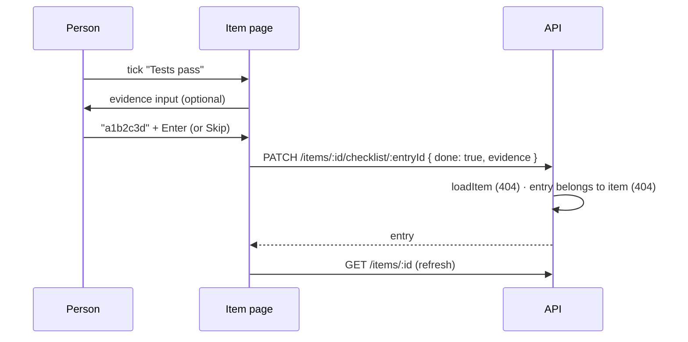
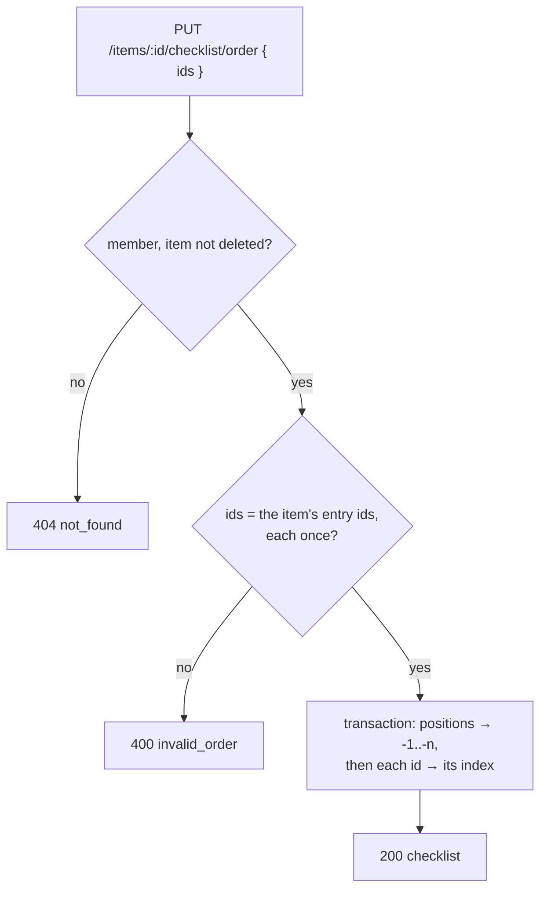

# 11: Done-when checklist

Status: Done

## Scope

The done-when checklist on an item (`MVP.md` §4 "Checklist: done-when items, each with a
done state and optional evidence"). It covers storage, the API and the item page.

- Each entry has text, a done flag, optional evidence (free text such as a commit SHA,
  test name or link) and a position.
- Any project member may add, edit, tick, untick, delete and reorder entries, since
  Members edit tickets (§4 roles).
- The item page shows a **Checklist** section under the description. Ticking an entry
  offers an optional evidence field, which can be edited inline afterwards.

Order (user decision): the checklist comes before the rules engine (§14 step 3). The
engine's checklist gates need entries to check, and they come in plan 12.

Limits (user decision): Standard projects have no limit. Guided keeps 3–6 as its
default. The presets already store this (`checklistMin` / `checklistMax` are null for
Standard and 3 / 6 for Guided). This plan enforces no limit in either mode.

Left out:

- **Checklist limits and the "In Review needs every entry ticked" gate.** These come in
  plan 12 (rules engine), which reads the project's `checklistMin` and `checklistMax`.
- **A done/total count on board cards.** It can come in a later web slice.
- **MCP tools** (`set_criteria`, `check_criterion`, `get_criteria`) come with the MCP
  server (§14 step 4) and will call the same service functions.
- **Who ticked what.** That needs the activity log (§14 step 4).

## Done when

- [x] A `ChecklistEntry` table (`itemId` with cascade delete, `text`, `done`,
      `evidence?`, `position`, unique `[itemId, position]`) with a migration
- [x] `POST /items/:id/checklist`, `PATCH /items/:id/checklist/:entryId` and
      `DELETE /items/:id/checklist/:entryId` work for any project member. They return
      `404 not_found` for a non-member, a deleted item or an entry of another item, and
      `400` for empty text. e2e tests cover each case.
- [x] `PUT /items/:id/checklist/order { ids }` reorders the entries. It returns
      `400 invalid_order` unless `ids` lists exactly the item's entries, once each.
- [x] `GET /items/:id` returns `checklist`, ordered by position
- [x] The item page has a Checklist section: add an entry, tick or untick it (with
      optional evidence when ticking), edit the text and evidence inline, delete it,
      and move it up or down
- [x] The seed has a Guided slice with a half-ticked checklist and one entry with
      evidence, titled with what to try

## Design

| Function                                                     | File                                   | What                                                                                                                                                                                                                      | Why                                                                                                                                              |
| ------------------------------------------------------------ | -------------------------------------- | ------------------------------------------------------------------------------------------------------------------------------------------------------------------------------------------------------------------------- | ------------------------------------------------------------------------------------------------------------------------------------------------ |
| `ChecklistEntry` model                                       | `api/prisma/schema.prisma`             | `id`, `itemId` (cascade), `text`, `done` (default false), `evidence` (nullable), `position`, timestamps. `@@unique([itemId, position])`.                                                                                  | Done-when 1. Its own table, not JSON on the item, so each entry has an id and the MCP tools can tick one entry without racing on the whole list. |
| `addChecklistEntry(itemId, userId, input)`                   | `items/item.service.ts`                | `loadItem` (404), then in one transaction: lock the item row, read the highest position, and insert at `max + 1`.                                                                                                         | Done-when 2. The lock stops two adds at once from taking the same position.                                                                      |
| `updateChecklistEntry(itemId, entryId, userId, input)`       | `items/item.service.ts`                | `loadItem`, then find the entry with `itemId` (404 if missing), then update `text`, `done` and `evidence`. Unticking keeps the evidence.                                                                                  | Done-when 2. Scoping the entry by item stops one item's URL from editing another item's entry.                                                   |
| `removeChecklistEntry(itemId, entryId, userId)`              | `items/item.service.ts`                | `loadItem`, then delete the entry and close the gap in one transaction, rewriting the rest in two steps the way `reorderChecklist` does.                                                                                  | Done-when 2. Keeps positions 0..n-1, so "move up" and the 1-based MCP index stay simple.                                                         |
| `reorderChecklist(itemId, userId, ids)`                      | `items/item.service.ts`                | `loadItem`, then `400 invalid_order` unless `ids` is exactly the item's entry ids. In one transaction: move every entry to a negative position, then set each to its index.                                               | Done-when 3. The two steps avoid clashes with the unique `[itemId, position]` while rows swap.                                                   |
| `findChecklist`, `insertEntry`, `updateEntry`, `deleteEntry` | `items/item.repository.ts`             | Plain Prisma calls that take `tx`, like the existing repository functions.                                                                                                                                                | ADR-0008: services run transactions, repositories run queries.                                                                                   |
| `checklistEntrySchema`, `itemSchema` (changed)               | `items/item.schema.ts`                 | The entry shape, `addChecklistEntrySchema` (`text` min 1), `updateChecklistEntrySchema` (all optional), `reorderChecklistSchema` (`ids`). `itemSchema` gets `checklist`.                                                  | Done-when 2–4. The OpenAPI spec and the generated web client come from these.                                                                    |
| `getItem` (changed)                                          | `items/item.repository.ts`             | `findItem` includes `checklist` ordered by `position`.                                                                                                                                                                    | Done-when 4.                                                                                                                                     |
| Routes and handlers                                          | `items/item.routes.ts`, `.handlers.ts` | Four routes with `describe()`, as `addBlocker` does.                                                                                                                                                                      | Done-when 2–3.                                                                                                                                   |
| `Checklist`                                                  | `web/.../items/item-detail.tsx`        | A section under `Description`: a list of rows (checkbox, text, evidence below, then ↑ ↓ Edit Delete) and an Add input at the bottom. Ticking opens an evidence input that saves on Enter, or Skip saves without evidence. | Done-when 5. It uses the generated hooks and the `refresh` / `onError` pattern of `useAddBlocker`.                                               |
| `seedGuided` (changed)                                       | `api/scripts/seed.ts`                  | A slice "Checklist: tick the rest, add evidence, reorder" with 4 entries: 2 ticked, 1 of them with evidence.                                                                                                              | Done-when 6.                                                                                                                                     |

Routes:

| Method and path                        | Who                | What                                        | Errors   |
| -------------------------------------- | ------------------ | ------------------------------------------- | -------- |
| `POST /items/:id/checklist`            | any project member | Add an entry at the end                     | 400, 404 |
| `PATCH /items/:id/checklist/:entryId`  | any project member | Edit the text, tick or untick, set evidence | 400, 404 |
| `DELETE /items/:id/checklist/:entryId` | any project member | Delete an entry and close the gap           | 404      |
| `PUT /items/:id/checklist/order`       | any project member | Set the order from a list of every entry id | 400, 404 |
| `GET /items/:id` (changed)             | any project member | Also returns `checklist`                    | 404      |

### Ticking an entry

### Reorder

### Notes

- The checklist is part of the item, so a soft-deleted item's entries stay with it and
  come back on restore. `loadItem` already returns 404 for deleted items.
- Positions start at 0 in the database. The MCP tools will show a 1-based index (§9).
- Tech debt: [TD-005](../tech-debt/005-seed-blocked-by-old-reviewer-project.md) (the seed
  could not be run against the shared database), [TD-006](../tech-debt/006-item-list-loads-checklists.md)
  (the item list loads every checklist).
- No new rule, so there are no rule cases for the seed. The seeded slice is there to
  try the UI.

## Changes

Commits:

- `9a2070b` docs: plan 11 checklist
- `b6a2695` feat(api): checklist entries on items
- `48d1c0f` feat(web): checklist on the item page

What changed and how:

- API: `ChecklistEntry` model and migration `20261006041610_checklist_entries`. The
  service has `addChecklistEntry`, `updateChecklistEntry`, `removeChecklistEntry` and
  `reorderChecklist`; the repository adds `lockItem` and the entry queries. Delete and
  reorder share `writePositions` (negative positions first, then 0..n-1). `GET /items/:id`
  returns `checklist` through `itemView`. e2e tests cover add, concurrent adds,
  tick/untick/evidence, empty text, 404s, delete, reorder and restore. `openapi.json` is
  regenerated.
- Web: a `Checklist` section under the description, with `ChecklistRow` (checkbox,
  evidence prompt with Enter / Skip / Escape, inline edit, up/down, delete) and an add
  input. It shows a done/total count next to the heading.
- Seed: the Guided slice "Checklist: tick the rest, add evidence, reorder".

Planned vs actual:

- Every checklist write (add, edit, delete, reorder) locks the item row; the plan only
  named the lock for add. Review finding: an edit racing a delete returned 500, so the
  edit now takes the lock too and gets 404. An entry-row lock for edits was considered
  and left out (user decision): the waits are milliseconds and one rule is simpler.
- Review finding: a repeated Enter in the add input could add the same entry twice. The
  add is ignored while one is pending (until its refresh ends) and the input is read-only.
- Reordering is optimistic (not in the plan): ↑ / ↓ swaps the entries in the cached item
  at once, as `saveNow` does, and rolls back if the save fails.
- Added a done/total count beside the Checklist heading (not in the plan; item page only,
  not on board cards).
- The seed slice could not be run: [TD-005](../tech-debt/005-seed-blocked-by-old-reviewer-project.md).
- `itemView` loads the checklist for list queries too: [TD-006](../tech-debt/006-item-list-loads-checklists.md).
