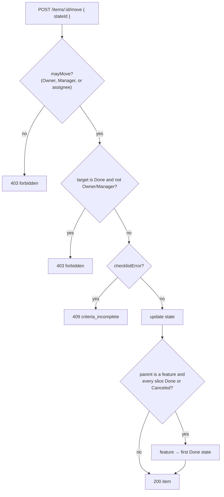
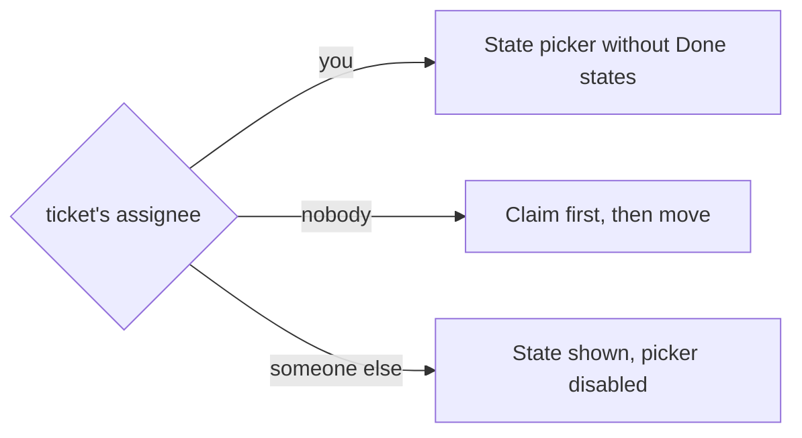

# 12: Rules engine, part 1: moves and checklist gates

Status: In Review

## Scope

The first part of the rules engine (`MVP.md` §14 step 3): the rules on who may move a
ticket and when, built on the checklist from plan 11.

- **Members move only tickets assigned to them** (user decision, a change to MVP §4,
  which said Members "move tickets across states"). An unassigned ticket has to be
  claimed first (plan 10). Owners and Managers move any ticket.
- **Only Owners and Managers move to Done** (MVP §4 roles, §5 step 8).
- **Checklist gates** (MVP §3, §5):
  - adding an entry past `checklistMax` is refused ("split this slice");
  - In Review and Done need every entry ticked, on any item (user decision);
  - slices and subtasks also need at least `checklistMin` entries when
    `checklistRequired` is on.
- **A feature goes Done automatically** when all its slices are Done or Canceled (MVP §4).
- **Moving gets its own endpoint** (user decision): `POST /items/:id/move`. `PATCH
/items/:id` keeps field edits only, so `updateProjectItem` shrinks back to field edits
  and the move flow reads top to bottom in `moveItem`. The MCP `move_item` tool (§9) will
  call the same service.

Every member can still edit titles, descriptions and checklists, including ticking
entries (user decision).

Left out (later plans):

- **Project settings:** `PATCH /projects/:id` for the mode, switches and checklist limits.
- **Label overrides:** they need labels.
- **The design-approval gate:** it needs designs (§14 step 7).
- **"Agents can't move to Done":** it needs agent identity from the MCP server (§14 step 4).
- **Editable Standard states.**
- **Reopening a feature** when one of its slices leaves Done.

## Done when

- [x] `POST /items/:id/move { stateId }` is the only way to change a ticket's state:
  - `PATCH /items/:id` no longer takes `stateId`, and `updateProjectItem` keeps field edits only;
  - the move flow lives in `moveItem`;
  - the board drop and the item page's State picker call the new endpoint;
  - the e2e tests move through it.
- [x] Moving to a new state:
  - a Member gets `403 forbidden` unless the ticket is assigned to them;
  - moving into a Done-category state needs an Owner or Manager (`403 forbidden`);
  - unit tests cover `mayMove`, and e2e tests cover each role.
- [x] The API exposes the move rule:
  - item rows and `GET /items/:id` return `canMove`;
  - `GET /projects/:id` returns `canMoveToDone`.

  On the web:
  - the item page's State picker is disabled when `!canMove`, and hides Done states when `!canMoveToDone`;
  - a board card with `!canMove` can't be dragged;
  - a refused drop shows the error toast.

- [x] Checklist gates, each covered by e2e tests:
  - with `checklistMax` set, adding an entry past it returns
    `409 checklist_max_exceeded` ("split this slice");
  - moving an item into In Review or a Done-category state is refused with
    `409 criteria_incomplete` when any of its entries is unticked (any item, any project;
    the message names them);
  - the same move is refused for a slice or subtask with `checklistRequired` on and
    fewer than `checklistMin` entries.
- [x] When a slice moves to Done or Canceled and every live slice of its feature is Done
      or Canceled, the feature moves to the project's first Done state in the same
      transaction. An e2e test covers it.
- [x] The seed has a ticket per case, titled with what to try and what happens, and MVP
      §4's Member row says "move tickets assigned to them"

## Design

Pure rules move into a new `apps/api/src/modules/items/item.rules.ts`. The existing
`kindError`, `mayAssign` and `wouldCreateCycle` move there from the "Rules" section of
`item.service.ts`, and the new rules join them. That puts every item rule in one file,
which the MCP tools (step 4) will import too.

| Function                                         | File                                                         | What                                                                                                                                                                                                                                                                                                                                                                                                                                                                                                                                                             | Why                                                             |
| ------------------------------------------------ | ------------------------------------------------------------ | ---------------------------------------------------------------------------------------------------------------------------------------------------------------------------------------------------------------------------------------------------------------------------------------------------------------------------------------------------------------------------------------------------------------------------------------------------------------------------------------------------------------------------------------------------------------- | --------------------------------------------------------------- |
| `mayMove(role, userId, assigneeId)`              | `items/item.rules.ts`                                        | True for an Owner or Manager. For a Member, true only when `assigneeId === userId`.                                                                                                                                                                                                                                                                                                                                                                                                                                                                              | Done-when 2–3. One place states the move rule.                  |
| `mayMoveToDone(role)`                            | `items/item.rules.ts`                                        | `CREATORS.includes(role)`.                                                                                                                                                                                                                                                                                                                                                                                                                                                                                                                                       | Done-when 2–3.                                                  |
| `checklistError(project, kind, entries, target)` | `items/item.rules.ts`                                        | Returns null, or a message naming the missing count or the unticked entries. Only for a `target` with the key `in_review` or the category DONE. Any item with entries needs them all ticked; the `checklistMin` count applies only when `checklistRequired` is on and `kind` is SLICE or SUBTASK.                                                                                                                                                                                                                                                                | Done-when 4. Pure, so it's unit-tested without a database.      |
| `featureDone(children)`                          | `items/item.rules.ts`                                        | True when there's at least one live child and every child's state category is DONE or CANCELED.                                                                                                                                                                                                                                                                                                                                                                                                                                                                  | Done-when 5.                                                    |
| `moveItem(id, userId, stateId)` (new)            | `items/item.service.ts`                                      | In order: 1. `loadItem` (404) and check the target state is in the project (400). 2. The same state as now: return the item, no checks. 3. `403` unless `mayMove`. 4. `403` when the target is DONE and not `mayMoveToDone`. 5. In a transaction: lock the item, then `409` from `checklistError`, then update the state. 6. If the parent is a FEATURE, the new state is DONE or CANCELED, `featureDone` is true for the siblings, and the feature's own checklist passes, the feature moves to the first DONE state in the same transaction. | Done-when 1, 2, 4, 5.                                           |
| `updateProjectItem` (changed)                    | `items/item.service.ts`                                      | Field edits only: title, description, priority, parent and assignee. `stateId` and the move code move out to `moveItem`.                                                                                                                                                                                                                                                                                                                                                                                                                                         | Done-when 1. Back to a short function.                          |
| `moveItemSchema`, route, `postMoveItem` (new)    | `items/item.schema.ts`, `item.routes.ts`, `item.handlers.ts` | `{ stateId: uuid }`. `updateItemSchema` drops `stateId`. The route uses `describe()`, as `addBlocker` does.                                                                                                                                                                                                                                                                                                                                                                                                                                                      | Done-when 1.                                                    |
| `addChecklistEntry` (changed)                    | `items/item.service.ts`                                      | Under the item lock: `409 checklist_max_exceeded` when `entries.length >= checklistMax`.                                                                                                                                                                                                                                                                                                                                                                                                                                                                         | Done-when 4. The lock already stops two adds from both passing. |
| `toItem`, item rows (changed)                    | `items/item.service.ts`, `items/item.schema.ts`              | Add `canMove: mayMove(role, userId, assigneeId)`.                                                                                                                                                                                                                                                                                                                                                                                                                                                                                                                | Done-when 3. The web reads the flag and never repeats the rule. |
| `getProject` (changed)                           | `projects/project.service.ts`                                | Add `canMoveToDone: mayMoveToDone(role)`.                                                                                                                                                                                                                                                                                                                                                                                                                                                                                                                        | Done-when 3.                                                    |
| State picker, board drag (changed)               | `web/.../items/item-detail.tsx`, `web/.../board/board.tsx`   | The picker is disabled when `!canMove`, and Done states are left out when `!canMoveToDone`. A card can't be dragged when `!canMove`. Both call the generated move hook instead of `useUpdateItem` with `stateId`; the picker keeps its optimistic update.                                                                                                                                                                                                                                                                                                        | Done-when 1, 3.                                                 |
| `seedGuided`, `seedMember` (changed)             | `api/scripts/seed.ts`                                        | One ticket per case: - move someone else's ticket → 403 - claim a ticket, then move it - a Member moves a ticket to Done → 403 - move to In Review with an unticked entry → 409 - add a 7th entry to a 6-entry slice → 409 - finish the last slice of a feature → the feature goes Done                                                                                                                                                                                                                                                        | Done-when 6.                                                    |

Routes that change:

| Method and path              | Change                                                                                                                                | Errors             |
| ---------------------------- | ------------------------------------------------------------------------------------------------------------------------------------- | ------------------ |
| `POST /items/:id/move` (new) | `{ stateId }`. The move rule, the Done role check and the checklist gate. Can also move the parent feature to Done. Returns the item. | 400, 403, 404, 409 |
| `PATCH /items/:id`           | No longer takes `stateId`                                                                                                             | 400, 403, 404      |
| `POST /items/:id/checklist`  | Refused past `checklistMax`                                                                                                           | 400, 404, 409      |
| `GET /items/:id`, item lists | Return `canMove`                                                                                                                      | 404                |
| `GET /projects/:id`          | Returns `canMoveToDone`                                                                                                               | 404                |

Errors:

| Code                     | Status | When                                                                          |
| ------------------------ | ------ | ----------------------------------------------------------------------------- |
| `forbidden`              | 403    | A Member moves a ticket that isn't theirs, or a Member moves a ticket to Done |
| `criteria_incomplete`    | 409    | A move to In Review or Done with too few entries or any unticked              |
| `checklist_max_exceeded` | 409    | Adding an entry past `checklistMax`                                           |

### Moving a ticket

### What a Member sees

### Notes

- Owners and Managers still need a complete checklist to move to Done. The gate has no
  bypass.
- The automatic feature Done skips the role check, because the system makes that move,
  not a person.
- A Member who unclaims an In Progress ticket leaves it in place. An Owner or Manager
  reassigns it.
- Standard states have no `in_review` key, so in Standard only the Done gate applies:
  unticked entries block Done, and there's no minimum while `checklistRequired` is off.
- `PATCH /items/:id` with `stateId` after this change: Zod drops the unknown field, so the
  state is ignored, not refused. The web and the MCP tools use `/move`.
- Moving the existing rules into `item.rules.ts` only moves code; their behaviour doesn't
  change. The existing unit tests move with them.

## Changes

Commits (on `feat/rules-moves-gates`):

- `eb6c262` feat(api): move endpoint, members move only their tickets, checklist gates
- `ac04b2a` feat(web): move endpoint, lock moves members can't make, instant checklist ticks
- docs: plan 12 moves and checklist gates (this file and MVP §4)

Also in the web commit, outside this plan (user requests): the checklist's evidence
input is gone (ticking saves at once; evidence still shows read-only and stays in the
API), and ticking is optimistic like reordering.

What changed and how:

- API: `items/item.rules.ts` now holds `kindError`, `mayAssign` and `wouldCreateCycle`
  (moved unchanged, with their unit tests) and the new `mayMove`, `mayMoveToDone`,
  `checklistError` and `featureDone`, with unit tests. `moveItem` (behind `POST /items/:id/move`)
  runs the move checks in the planned order and updates inside a transaction that locks
  the item (and the parent feature, when the slice finishes) and moves the feature to the
  first Done state. `updateProjectItem` and `PATCH /items/:id` keep field edits only
  (`updateItemSchema` has no `stateId`). `addChecklistEntry` refuses past `checklistMax` under the item lock. Item rows,
  `GET /items/:id` and the trash list return `canMove`; `GET /projects/:id` returns
  `canMoveToDone`. No migration. `openapi.json` is regenerated. e2e tests cover each role,
  both gate cases, the max and the automatic feature Done.
- Web: the board drop and the State picker call the generated `useMoveItem` hook (the
  picker keeps its optimistic update and rollback in `moveNow`); the State picker is disabled when `!canMove` and leaves out Done states when
  `!canMoveToDone`; a card with `!canMove` isn't draggable. The refused-drop toast
  already existed in the board's `onError`.
- Seed: tickets for each case in the Guided (TG) and Member (TM) projects. MVP §4's Member
  row says "move tickets assigned to them".

Planned vs actual:

- `loadItem` now returns `{ item, role }` (it uses `requireRole`), so every item view gets
  the caller's role for `canMove`. `toItem` and `toListRow` take `role` and `userId`.
- `itemView` also selects `checklistRequired`, `checklistMin` and `checklistMax`, so the
  gate and the max need no extra query. `updateItem` takes a transaction.
- The state is compared with the current one: a move to the same `stateId` runs no move
  checks and returns the item.
- The move endpoint was built after the first version, which moved through `PATCH`
  (user decision); the move code moved out of `updateProjectItem` unchanged. e2e tests
  move through `POST /items/:id/move`, and one test checks that `PATCH` ignores `stateId`.
- `mayMove` uses the ticket's current assignee, so a Member can't claim and move in one
  request (they are two calls now); claim first.
- A feature that is already Done or Canceled is left alone when its last slice finishes.
- The existing e2e test where a Member moved an unassigned task to Done now claims it
  instead, since moves changed.
- The seed was typechecked and linted, not run (it writes to the dev database).
- Changed after the build (user decision): the "all ticked" gate covers every item with
  entries (features and tasks too, in any project), not only slices and subtasks with
  `checklistRequired` on. The minimum count stays for slices and subtasks only. The
  automatic feature Done runs the same check on the feature's own entries: with one
  unticked, the feature stays open and has to be moved by hand once ticked.
