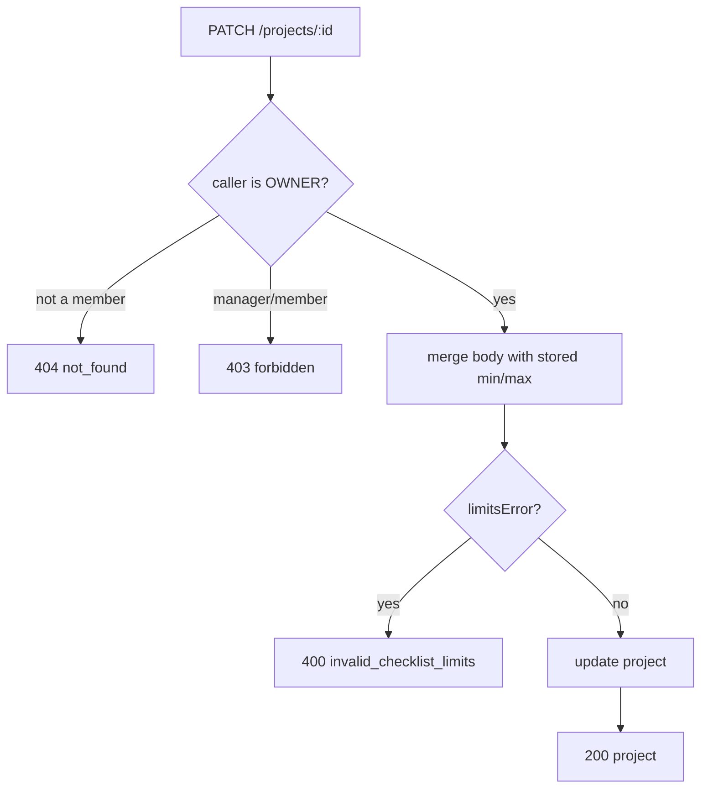
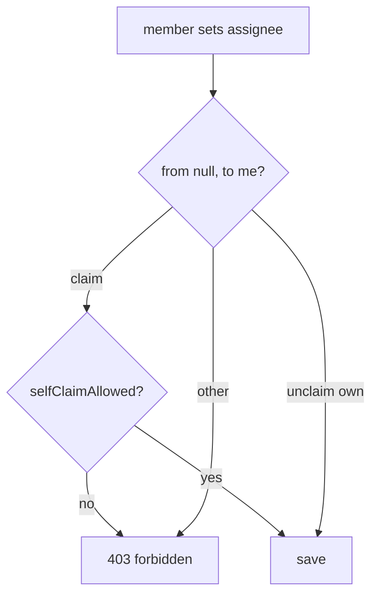

# 13: Project settings

Status: Done

## Scope

The rest of the rules engine that the MCP server will rely on (`MVP.md` §3, §14 step 3):
owners change a project's name, rule switches and checklist limits after creating it, and
can turn off members claiming tickets themselves.

- **`PATCH /projects/:projectId`**, owner only (ADR-0007): `name`, `checklistRequired`,
  `checklistMin`, `checklistMax`, `designRequired`, `approvalRequired`,
  `approverNotAuthor`, `plannedVsActual`, `selfClaimAllowed`. Every field optional.
- **New switch `selfClaimAllowed`** (default `true`, both presets). When off, a member
  can't claim a free ticket; they can still unclaim their own. Owners and managers
  assign as before.
- **New rules apply from then on** (§3): lowering `checklistMax` doesn't touch existing
  checklists; it only refuses new entries past the limit (the existing check).
- **Settings page** `/p/[projectId]/settings`: owners edit, others see the values
  read-only.

Left out:

- **Switching mode** (Standard ↔ Guided). Nobody needs it soon, and Standard → Guided
  means replacing states. Recorded in `docs/tech-debt/007-mode-switching.md`.
- **Changing `keyPrefix`**: item keys like UG-12 are already in commits and docs.
- **Label overrides** (need labels), **editable Standard states**, **reopening a
  feature**.

## Done when

- [x] `PATCH /projects/:projectId` lets the owner change the name, the switches and the
      checklist limits; managers and members get 403, non-members 404.
- [x] Bad limits are refused with 400 `invalid_checklist_limits`: min or max below 1, or
      min greater than max.
- [x] With `selfClaimAllowed` off, a member's claim is refused (403); unclaiming their own
      ticket still works, and owners and managers still assign anyone.
- [x] `GET /projects/:projectId` returns `selfClaimAllowed`, `canEditSettings` and
      `canClaim`; the item page hides **Claim** when `canClaim` is false.
- [x] `/p/[projectId]/settings` shows the switches and limits: the owner saves changes,
      managers and members see them read-only. The sidebar links to it.
- [x] The seed has a project with self-claim off and items titled with what to try, and
      a Guided project with `checklistMax` lowered below an existing checklist.

## Design

| Function                                              | File                                                                                | What                                                                                        | Why                                                                                                 |
| ----------------------------------------------------- | ----------------------------------------------------------------------------------- | ------------------------------------------------------------------------------------------- | --------------------------------------------------------------------------------------------------- |
| `updateProjectSchema`                                 | `projects/project.schema.ts`                                                        | Zod: every settable field optional; `checklistMin/Max` int ≥ 1 or null                      | One body shape for the route and the generated web hook                                             |
| `limitsError(min, max)`                               | `projects/project.rules.ts` (new)                                                   | Message when min > max, else null                                                           | A rule the MCP tool will reuse; pure so it's unit tested                                            |
| `updateProject(projectId, userId, input)`             | `projects/project.service.ts`                                                       | `requireRole(…, ['OWNER'])`, merge input with the stored limits, `limitsError`, then save   | The merge catches "max lowered below the stored min" too                                            |
| `updateProject(id, data)`                             | `projects/project.repository.ts`                                                    | `prisma.project.update`                                                                     | Plain repo call, like the others                                                                    |
| `patchProject`                                        | `projects/project.handlers.ts` + `project.routes.ts`                                | `PATCH /:projectId` with `describe(...)`                                                    | Same pattern as the existing routes                                                                 |
| `mayAssign(role, userId, from, to, selfClaimAllowed)` | `items/item.rules.ts`                                                               | Adds: a member's claim needs `selfClaimAllowed`                                             | Keeps every assign rule in one function; `updateProjectItem` passes `item.project.selfClaimAllowed` |
| `getProject`                                          | `projects/project.service.ts`                                                       | Adds `canEditSettings` (owner) and `canClaim` (owner/manager, or member with self-claim on) | Web gets rules as flags (ADR-0007), never repeats them                                              |
| `SettingsPage`                                        | `web/components/projects/settings-page.tsx` + `app/p/[projectId]/settings/page.tsx` | Form with switches and limit inputs, `useUpdateProject`; read-only when `!canEditSettings`  | Owners need a place to change them                                                                  |

Schema: `selfClaimAllowed Boolean @default(true)` on `Project`, one migration; added to
both presets and `projectSchema`. `item.repository.ts`'s project select adds it.

## Changes

Commits:

- `11134ef` feat(api): project settings endpoint and self-claim switch
- `c5b1eb9` feat(web): project settings page, hide claim when self-claim is off

What changed and how:

- Schema and migration `20261007055904_project_self_claim`: `Project.selfClaimAllowed
Boolean @default(true)`, in both presets, `projectSchema` and `item.repository.ts`'s
  project select. Applied to the dev database by `bun run db:migrate`.
- `PATCH /projects/:projectId` (`patchProject`, `updateProject` in service and
  repository, `updateProjectSchema`): owner only through `requireRole`, merges the body
  with the stored min/max, `limitsError` in the new `project.rules.ts` (unit tested in
  `project.rules.spec.ts`), 400 `invalid_checklist_limits`. It also refuses a limit
  below 1.
- `mayAssign` takes `selfClaimAllowed`; `updateProjectItem` passes
  `item.project.selfClaimAllowed` and words the 403 for each case. Cases added to
  `item.service.spec.ts`.
- `getProject` returns `canEditSettings` and `canClaim`.
- Web: `/p/[projectId]/settings` (`settings-page.tsx`, shadcn `switch` added), sidebar
  Settings link, Claim hidden in `AssigneeField` when `canClaim` is false.
- Migration `20261007062205_project_checklist_limits_check`: a `project_checklist_limits`
  CHECK (limits ≥ 1, min ≤ max), so two PATCHes racing past the service's check can't
  store min > max. The repository returns null when the CHECK refuses the update and the
  service answers 400 `invalid_checklist_limits`. Added after review.
- Web after review: the four design switches show "Currently unavailable" and are
  disabled until designs ship (§14 step 7); Board is highlighted only on the board and
  item pages.
- Seed: `TC` (self-claim off, you are a member) and `TL` (Guided, `checklistMax` lowered
  to 3 under a 5-entry checklist, you own it).

Planned vs actual: as planned. Not run: `bun run db:seed` fails on the dev database before reaching the
new code, because an old seed project (key TR) is still named "Seed · Reviewer" (from
before the manager rename); the seed code itself typechecks and lints.
