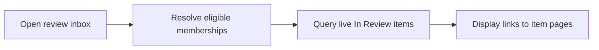

# 14: Review inbox

Status: Aligning

## Scope

A cross-project page where owners and managers find implementation work waiting for their review. The first slice reads existing live items in Guided projects whose state key is `in_review`, and links to their item pages. It does not depend on the proposed knowledge features.

This is a potential feature proposal, not an implementation commitment. Function
names, routes, storage, and permission choices below are tentative. Follow Uniloom's
existing app guides when implementing; confirm scope and set the plan to Ready first.

## Dependencies and sequencing

Existing sessions, consent, membership, item states, and item detail pages. The user requested this as the next candidate, but explicitly requires a separate confirmation before implementation.

Plan numbers are stable identifiers, not the build order. These proposals do not
replace MVP.md or authorize bringing later capabilities forward.

## Done when

- [ ] `GET /api/reviews` returns only live `in_review` items from projects where the caller is currently an Owner or Manager; each row includes item id/key/title, project id/name, priority, assignee, and updatedAt.
- [ ] The endpoint supports an optional project filter and bounded cursor pagination, ordered by updatedAt then id. An inaccessible project filter returns 404 without exposing its work.
- [ ] `/reviews` renders inside AppShell, links each row to the existing item page, and provides project filtering, loading, empty, error/retry, and load-more states.
- [ ] After an item leaves In Review or is deleted, refreshing the inbox removes it; a role or membership change is respected on the next request. The sidebar exposes the page without granting access to restricted rows.

## Design

| Function / component | Proposed location | What | Why |
| --- | --- | --- | --- |
| `listReviewItems` | `modules/reviews/review.service.ts` | Resolve the caller's eligible projects and validate the optional filter. | Keep membership and review eligibility on the server. |
| `findReviewItems` | `modules/reviews/review.repository.ts` | Select eligible live items and a cursor page with project and assignee summaries. | Read the existing data without a second queue to synchronize. |
| `getReviews` | `modules/reviews/review.handlers.ts + review.routes.ts` | Validate filter/cursor/limit and publish the OpenAPI-described response. | Supply the generated web client. |
| `ReviewInbox` | `components/reviews/review-inbox.tsx` | Render and paginate the queue through generated hooks. | Give reviewers one entry point across projects. |

Locations are relative to apps/api/src or apps/web/src. Backend queries stay in
repositories; services own permissions and behavior; handlers describe OpenAPI
contracts; browser calls use generated hooks. Add files only when the slice needs them.

## Boundaries and decisions to confirm

Proposed API failures: 400 invalid_input for malformed filters/cursors, 401 without a session, 403 consent_required, and 404 for an inaccessible explicit project. The first version is read-only: completion uses the existing item page and service. It has no new review decisions, review-age claims, reviewer assignment, notifications, bulk approval, design-approval queue, or ADR queue. Standard projects have no explicit review state in the current preset, so their review semantics need a separate proposal. Seed and API checks must include Owner, Manager, Member, former member, another project's items, deleted items, and pagination ties. Ordering by updatedAt is not time spent awaiting review. Cross-project placement and owner/manager-only eligibility remain proposals for the user's confirmation.

Any durable architecture choice identified during alignment should be recorded in a
Proposed ADR before implementation; this proposal does not accept one in advance.

## Changes

Documentation proposal only. No implementation, migration, commit, or push.
Acceptance items remain unchecked until the feature is built and verified.
