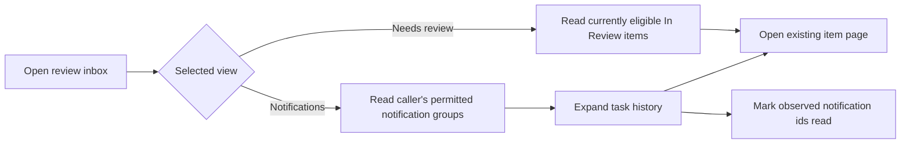

# 14: Review inbox and notification history

Status: In Review

## Scope

Final slice of the review inbox: a global /reviews page provides current review work
and per-user notification history. Actual review submissions are retained, repeated
submissions are grouped by task in the notification view, and read state is independent
for each recipient. Project Owners and Managers are the initial review audience.

The user confirmed this behavior and the three-slice split. The original read-only
proposal is replaced by this final UI/API slice. Plan numbering preserves identity:
build **30 → 31 → 14**, not numeric order.

## Dependencies

[Plan 30](30-review-boundary-and-events.md) enforces the review boundary and records
submissions. [Plan 31](31-review-notification-worker.md) creates per-user notifications.
[ADR-0011](../adr/0011-review-events-and-notifications.md) is Accepted.
Use existing sessions, consent, membership, generated API hooks, and AppShell.

## Done when

- [x] GET /api/reviews returns bounded cursor pages of live In Review items only from projects where the caller currently holds Owner/Manager authority, with project filtering, item/project identity, priority, assignee, and current state; inaccessible explicit projects return 404.
- [x] GET /api/notifications returns the caller's history grouped by project/task, with latest submission, total/unread counts, and whether the task currently needs review. Reads recheck current review authority and never expose another user's records or inaccessible project content.
- [x] GET /api/notifications/items/:itemId expands a group into bounded pages of the caller's individual notifications and their submission context, keeping actual resubmissions distinct and historical notifications available after completion.
- [x] POST /api/notifications/read accepts explicitly observed notification ids and marks only the caller's permitted records read, idempotently; POST /api/notifications/unread reverses read state under the same authorization checks; a concurrent new notification remains unread, and foreign ids cannot be updated.
- [x] /reviews renders Needs review and Notifications views inside AppShell with project filters, unread indication, expandable history, item links, loading/empty/error/retry states, and pagination; actions mark the displayed notification ids read.
- [x] Completed/canceled or returned items leave Needs review after refresh while history remains labelled with current state; role loss and membership removal hide restricted records, and seed cases demonstrate grouping and per-user read independence.

## Design

Backend locations are relative to apps/api/src; frontend locations to apps/web/src.

| Function / component                                                           | File                                             | What                                                                        | Why                                                                |
| ------------------------------------------------------------------------------ | ------------------------------------------------ | --------------------------------------------------------------------------- | ------------------------------------------------------------------ |
| `listReviewItems`                                                              | modules/reviews/review.service.ts                | Authorize project filters and list current eligible review work.            | Reflect what requires action even while a worker is delayed.       |
| `findReviewItems`                                                              | modules/reviews/review.repository.ts             | Read bounded current-state summaries with eligible membership filtering.    | Keep the actionable queue derived from source-of-truth item state. |
| `listNotificationGroups / listItemNotifications`                               | modules/notifications/notification.service.ts    | Return only the caller's currently permitted grouped/history records.       | Preserve per-user history without leaking project content.         |
| `findNotificationGroups / findItemNotifications`                               | modules/notifications/notification.repository.ts | Aggregate task groups and paginate individual rows in deterministic order.  | Group display while retaining every underlying notification.       |
| `markNotificationsRead`                                                        | modules/notifications/notification.service.ts    | Validate ids and recipient/access authority, then set readAt on those rows. | Mark observed records without consuming new arrivals.              |
| `getReviews / getNotifications / getItemNotifications / postReadNotifications` | review and notification handlers/routes          | Validate parameters, call services, and describe OpenAPI contracts.         | Generate the typed browser hooks.                                  |
| `ReviewInbox`                                                                  | components/reviews/review-inbox.tsx              | Render current work and notification views with project filtering.          | One entry point for reviewers.                                     |
| `NotificationGroup`                                                            | components/reviews/notification-group.tsx        | Expand history and mark displayed entries read.                             | Control noise while keeping submissions inspectable.               |

## Proposed additions to confirm before Ready

- Group by project/task per recipient, with latest-first history and an unread count.
  Read mutations operate on explicit displayed ids; loading or marking a group does
  not implicitly consume hidden pages or notifications delivered afterward.
- Recheck current Owner/Manager authority for both current-work and history reads.
  Recipients who lose review authority do not retain visibility through old records.
- Soft-deleted items disappear from Needs review. History can show a generic
  unavailable-item entry within an otherwise eligible project, without rendering
  hidden item content or a working item link.
- Cursor pagination and refresh use generated hooks. Start with refresh-on-focus
  and explicit refresh; no WebSocket/SSE dependency or notification timer guarantee.

Proposed errors: 400 invalid_input, 401 unauthenticated, 403 consent_required, and
404 for inaccessible explicit projects/items/notification ids. Mark-read validates
the full requested batch before updating it. Empty default lists are successful reads.

This slice adds no approval/completion endpoint. Owners/Managers use the existing
item page and move service. It does not implement design approval or ADR acceptance.
Standard-mode review semantics remain a separate feature. Email batching, move
rate limits, notification preferences, and self-notification suppression are deferred.
Future improvement: finer reviewer selection than every project Owner/Manager.

## Verification

API cases must exercise different recipients reading the same submission, missing
and foreign ids, role/membership loss, current-state changes, group/history pagination,
and a new notification arriving during a mark-read request. Browser checks cover both
views, history expansion, permission-driven move controls, navigation, and failure
states. Regenerate OpenAPI and hooks; run relevant API/web checks and build. Read the
installed Next.js guides before writing route/framework code.

## Changes

Implemented GET /api/reviews, GET /api/notifications,
GET /api/notifications/items/:itemId, POST /api/notifications/read, and
POST /api/notifications/unread. Current Owner/Manager authority controls all reads;
read/unread batches validate every explicit id before changing any record. Deleted
items use generic unavailable summaries; actor deletion preserves submission history.
OpenAPI now describes query parameters, and the generated hooks drive the web page.

/reviews replaces preview data with live queue/history pages, project filtering,
refresh, loading/empty/error/retry states, bounded pagination, real lazy previews,
and separate task-title/project links. Opening a history page marks only rendered
ids read, with immediate feedback, rollback/retry, and a Mark as unread action.
An opened group remains inspectable under Unread only until closed. The user requested
removing introductory descriptions and keeping disclosures without animation.

Verification: API/database cases cover recipient independence, concurrent unseen
arrivals, idempotent read timestamps, foreign/missing batches, cursor pages, completed
and returned work, deletion, and access revocation. Temporary Chrome checks using
isolated auth and API contract fixtures pass for navigation targets, previews,
keyboard controls, observed-id consumption, unread/reopen, pagination, read failure
rollback/retry, query errors, role-loss clearing, and 320/375px layouts with no runtime
errors. Browser fixtures are mocked; database-backed API cases use the real dev DB.
Lint/typecheck, API/web builds, 72 unit tests, and Compose validation pass. The full
113-case API run initially had one outdated OpenAPI expectation; after adding the five
new operations, its entire 36-case file passed on rerun. The other 112 cases passed.

Planned vs actual: incorporated the user-selected unread action and independent
preview controls. Explicit refresh and refresh-on-focus remain the delivery visibility
mechanism; no SSE/WebSocket or timer guarantee. Finer recipient policy and retention
remain deferred; see [TD-009](../tech-debt/009-review-history-retention.md).
Committed with its related implementation; publishing in the review inbox PR. Work remains on feat/review-inbox-live; the user reviews next.

## UI-first follow-up

[Plan 29](29-review-inbox-ui.md) implements the sample UI first. The user chose
inline collapsible task previews, automatic reading of displayed
submissions on opening a notification group, and a Mark as unread action. A read
group stays visible under Unread only while open. The live integration must retain
these interactions and define the authorized, idempotent unread mutation before
the live UI is integrated. POST /api/notifications/unread uses the same full-batch authorization and explicit-id contract as marking read.

The user authorized continuing with the live implementation after reviewing the UI.

The user requested removing introductory descriptions, adding task-title and project
navigation in Needs review, and retaining inline previews. Live integration uses generated hooks;
only loaded history entries become read, with an immediate optimistic indication and
errors that permit retry. No animation is added.

User refinement: review and notification cards use a thin top border colored by
the current task state, matching the existing board tokens. State labels remain
visible on mobile; the unread dot still indicates read state independently. All
current events are review submissions, so this adds no invented notification types
or approval outcomes. Future event types can use distinct type icons when introduced.

The user rejected the colored card edges. Removed the state-colored top borders;
cards return to their prior neutral borders. State labels remain visible on mobile.

Publishing: backend commit `200b139`, inbox UI commit `599fb92`, and dev setup
commit `315c96d`. Integrated the latest dev label/schema and component changes.
Review event/worker plans are numbered 30/31 and the architecture ADR is 0011
to avoid collisions with the newly merged label plans and ADR.

User refinement: the sidebar Review inbox link shows a small status dot whenever
the caller has current review work or unread notifications. Read history alone does
not keep it active. The tooltip and screen-reader text distinguish pending review
from unread notifications. Generated bounded queries reuse existing authorization;
board/detail moves and inbox refresh invalidate inbox queries, as do read/unread
updates. Status follows the existing mount/focus/manual-refresh behavior.
