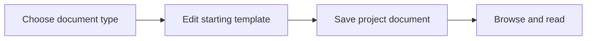

# 15: Typed knowledge documents

Status: Aligning

## Scope

A project knowledge library with Markdown documents for product briefs, proposals, specifications, and reference notes. Each type supplies a small starting template; a document records its purpose without imposing a full approval workflow.

This is a potential feature proposal, not an implementation commitment. Function
names, routes, storage, and permission choices below are tentative. Follow Uniloom's
existing app guides when implementing; confirm scope and set the plan to Ready first.

## Dependencies and sequencing

Existing project membership and Markdown/Mermaid rendering. Reuse or extend the documents capability planned in MVP §8 and §14 step 10 rather than creating a parallel store.

Plan numbers are stable identifiers, not the build order. These proposals do not
replace MVP.md or authorize bringing later capabilities forward.

## Done when

- [ ] Owners and managers can create a project document with a stable id, title, kind, body, and author; each supported kind has an editable starting template.
- [ ] Project members can list and read documents by kind and title; callers outside the project cannot retrieve them.
- [ ] An author, Owner, or Manager can edit or archive a document under server-enforced permissions; archived documents remain available through an explicit archive filter.
- [ ] The library and document pages render Markdown and Mermaid and distinguish loading, empty, error, and archived states.

## Design

| Function / component | Proposed location | What | Why |
| --- | --- | --- | --- |
| `createDocument` | `modules/documents/document.service.ts` | Check membership and creation permissions, then store typed content. | Keep the library consistent with project access. |
| `listDocuments` | `modules/documents/document.repository.ts` | Filter bounded document summaries by project, kind, title, and archive state. | Make documents discoverable without fetching every body. |
| `KnowledgeLibrary / DocumentPage` | `components/documents/` | Browse summaries and read or edit one document. | Use existing UI and Markdown conventions. |

Locations are relative to apps/api/src or apps/web/src. Backend queries stay in
repositories; services own permissions and behavior; handlers describe OpenAPI
contracts; browser calls use generated hooks. Add files only when the slice needs them.

## Boundaries and decisions to confirm

Templates describe the problem, scope, behavior, and relevant trade-offs; they do not require every section for every feature. ADRs and executable item designs retain their own planned workflows and can be linked later. Leave revisions, approvals, full-text search, arbitrary folders, attachments, and onboarding collections to separate slices.

Any durable architecture choice identified during alignment should be recorded in a
Proposed ADR before implementation; this proposal does not accept one in advance.

## Changes

Documentation proposal only. No implementation, migration, commit, or push.
Acceptance items remain unchecked until the feature is built and verified.
