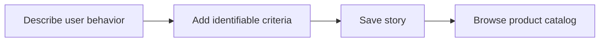

# 16: Structured user-story catalog

Status: Aligning

## Scope

Store durable product behavior separately from temporary implementation tickets. A story has a persona, desired action, benefit, and stable acceptance-criterion ids.

This is a potential feature proposal, not an implementation commitment. Function
names, routes, storage, and permission choices below are tentative. Follow Uniloom's
existing app guides when implementing; confirm scope and set the plan to Ready first.

## Dependencies and sequencing

Existing project membership. Linking stories to work and evidence is proposed separately in plan 19.

Plan numbers are stable identifiers, not the build order. These proposals do not
replace MVP.md or authorize bringing later capabilities forward.

## Done when

- [ ] Owners and managers can create a story with a stable project-local key, title, persona, desired action, benefit, and acceptance criteria whose ids survive reordering.
- [ ] Members can browse and read stories, filter by product area or archive state, and search titles within a bounded result set.
- [ ] Owners and managers can edit or archive stories without changing their keys or silently replacing acceptance-criterion ids.
- [ ] Story pages display the product behavior and criteria separately from work-item state; non-members cannot access their records.

## Design

| Function / component | Proposed location | What | Why |
| --- | --- | --- | --- |
| `createStory / updateStory` | `modules/stories/story.service.ts` | Enforce project permissions and stable story/criterion identity. | Keep references useful as wording evolves. |
| `findStories` | `modules/stories/story.repository.ts` | Read bounded summaries by project and filters. | Support a behavior catalog without loading all details. |
| `StoryCatalog / StoryPage` | `components/stories/` | Browse and author structured product behavior. | Separate enduring requirements from execution status. |

Locations are relative to apps/api/src or apps/web/src. Backend queries stay in
repositories; services own permissions and behavior; handlers describe OpenAPI
contracts; browser calls use generated hooks. Add files only when the slice needs them.

## Boundaries and decisions to confirm

This proposal does not add another level to Task/Subtask or Feature/Slice. A story's existence is not proof of implementation. Imports, evidence, revisions, and platform status are separate proposals. Proposed writes follow the existing Owner/Manager planning role; permissions need confirmation before implementation.

Any durable architecture choice identified during alignment should be recorded in a
Proposed ADR before implementation; this proposal does not accept one in advance.

## Changes

Documentation proposal only. No implementation, migration, commit, or push.
Acceptance items remain unchecked until the feature is built and verified.
