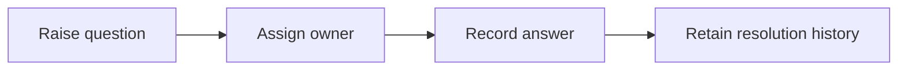

# 17: Open questions and resolution records

Status: Aligning

## Scope

Project questions with an accountable owner, optional item/document context, and a recorded answer. The initial slice makes uncertainty visible without introducing approval gates.

This is a potential feature proposal, not an implementation commitment. Function
names, routes, storage, and permission choices below are tentative. Follow Uniloom's
existing app guides when implementing; confirm scope and set the plan to Ready first.

## Dependencies and sequencing

Existing items and membership; document links are available only after plan 15.

Plan numbers are stable identifiers, not the build order. These proposals do not
replace MVP.md or authorize bringing later capabilities forward.

## Done when

- [ ] A project member can create an open question with its text, optional current-member owner, and optional same-project item context.
- [ ] Members can list and filter open questions by owner and read the question's resolution history.
- [ ] The question owner, Owner, or Manager can resolve it with a required answer or reopen it with a required reason; each transition retains the actor and timestamp.
- [ ] Referenced items/documents and question owners are checked on the server; foreign-project references and non-member reads are refused.

## Design

| Function / component | Proposed location | What | Why |
| --- | --- | --- | --- |
| `createQuestion` | `modules/questions/question.service.ts` | Validate context and owner membership before saving. | Make decisions actionable rather than buried in prose. |
| `resolveQuestion / reopenQuestion` | `modules/questions/question.service.ts` | Check authority and append a resolution transition. | Preserve how an answer changed over time. |
| `QuestionList / QuestionPage` | `components/questions/` | Show open questions and the recorded answers. | Give people a focused decision queue. |

Locations are relative to apps/api/src or apps/web/src. Backend queries stay in
repositories; services own permissions and behavior; handlers describe OpenAPI
contracts; browser calls use generated hooks. Add files only when the slice needs them.

## Boundaries and decisions to confirm

Reopening records history rather than erasing an answer. Questions do not automatically block an item or design in this slice. Decision-gating policy, notifications, and an inbox category require later confirmed scope. Add permission and invalid-reference cases to the seed when implemented.

Any durable architecture choice identified during alignment should be recorded in a
Proposed ADR before implementation; this proposal does not accept one in advance.

## Changes

Documentation proposal only. No implementation, migration, commit, or push.
Acceptance items remain unchecked until the feature is built and verified.
