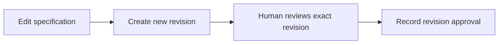

# 18: Specification revisions and human approval

Status: Aligning

## Scope

Preserve specification snapshots and attach human approval to an exact revision. Editing an approved specification creates a new unapproved revision while keeping the prior approval readable.

This is a potential feature proposal, not an implementation commitment. Function
names, routes, storage, and permission choices below are tentative. Follow Uniloom's
existing app guides when implementing; confirm scope and set the plan to Ready first.

## Dependencies and sequencing

Plan 15; explicit actor identity for human versus agent callers. Coordinate with the designs capability in MVP §6 and §14 step 7; document approval does not automatically replace item-design approval.

Plan numbers are stable identifiers, not the build order. These proposals do not
replace MVP.md or authorize bringing later capabilities forward.

## Done when

- [ ] Each specification edit creates an immutable numbered revision with body, author, and timestamp; an expected-revision check rejects stale edits instead of overwriting newer work.
- [ ] Revision history and a comparison view identify changes between selected revisions without altering the stored snapshots.
- [ ] An eligible human Owner or Manager can approve an exact revision, subject to the project's author-separation setting; agent callers cannot approve even when their user holds that role.
- [ ] Editing after approval preserves the old approval and clearly marks the current revision unapproved; concurrent edit/approval requests cannot approve content different from the submitted revision.

## Design

| Function / component | Proposed location | What | Why |
| --- | --- | --- | --- |
| `createSpecificationRevision` | `modules/documents/document.service.ts` | Compare the expected revision and save a new snapshot transactionally. | Prevent lost edits and preserve approved content. |
| `approveSpecificationRevision` | `modules/documents/document.service.ts` | Check actor kind, role, authorship, and exact revision. | Make approval attributable and specific. |
| `RevisionHistory / RevisionComparison` | `components/documents/` | Display snapshots, differences, and approval status. | Make subsequent changes reviewable. |

Locations are relative to apps/api/src or apps/web/src. Backend queries stay in
repositories; services own permissions and behavior; handlers describe OpenAPI
contracts; browser calls use generated hooks. Add files only when the slice needs them.

## Boundaries and decisions to confirm

Specification revisions do not automatically reset item workflow states in this slice. Rules connecting specification approval to Ready need their own confirmed scope. Relevant server rules and seed cases include agent approval refusal, same-author settings, stale edits, and revision races. Storage and approval-policy choices remain proposed until an ADR is accepted.

Any durable architecture choice identified during alignment should be recorded in a
Proposed ADR before implementation; this proposal does not accept one in advance.

## Changes

Documentation proposal only. No implementation, migration, commit, or push.
Acceptance items remain unchecked until the feature is built and verified.
