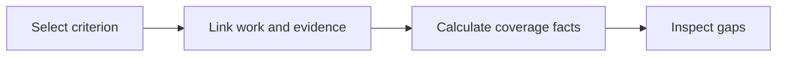

# 19: Requirement links and coverage view

Status: Aligning

## Scope

Connect story acceptance criteria to work items and evidence, then show missing links and claimed progress. Start with explicit project-local relationships and a table, not inferred relationships.

This is a potential feature proposal, not an implementation commitment. Function
names, routes, storage, and permission choices below are tentative. Follow Uniloom's
existing app guides when implementing; confirm scope and set the plan to Ready first.

## Dependencies and sequencing

Plan 16 and existing items/checklists. Evidence begins as a cited record; integrations can verify it later.

Plan numbers are stable identifiers, not the build order. These proposals do not
replace MVP.md or authorize bringing later capabilities forward.

## Done when

- [ ] Owners and managers can link a specific criterion to one or more same-project work items; members can read the links and cannot attach foreign-project items.
- [ ] Members can attach an evidence record to a criterion or linked work item, recording its source, submitting actor, timestamp, and repository/commit when applicable.
- [ ] A project coverage view identifies criteria with no work links, linked work still open, completed work without evidence, and evidence awaiting human verification.
- [ ] Only an eligible human Owner or Manager can record human verification; user assertions, external check results, and human verification remain distinct facts.

## Design

| Function / component | Proposed location | What | Why |
| --- | --- | --- | --- |
| `linkCriterionToItem` | `modules/stories/story.service.ts` | Validate authority and both endpoints before storing a link. | Make requirement coverage explicit. |
| `recordEvidence / verifyEvidence` | `modules/evidence/evidence.service.ts` | Store attributed evidence and a separate human verification action. | Avoid presenting a claim as independently established. |
| `getCoverage` | `modules/stories/story.service.ts` | Summarize criterion links, item states, and evidence. | Expose concrete gaps without guessing correctness. |
| `CoveragePage` | `components/stories/coverage-page.tsx` | Render a filterable coverage table. | Make gaps easy to inspect. |

Locations are relative to apps/api/src or apps/web/src. Backend queries stay in
repositories; services own permissions and behavior; handlers describe OpenAPI
contracts; browser calls use generated hooks. Add files only when the slice needs them.

## Boundaries and decisions to confirm

No automatic correctness score or global knowledge graph is required. Unverified links do not prove behavior. Evidence verification concerns a recorded scope/version and must not silently carry over after material criterion changes. Include link permissions, missing evidence, agent claims, and human verification in seed cases.

Any durable architecture choice identified during alignment should be recorded in a
Proposed ADR before implementation; this proposal does not accept one in advance.

## Changes

Documentation proposal only. No implementation, migration, commit, or push.
Acceptance items remain unchecked until the feature is built and verified.
