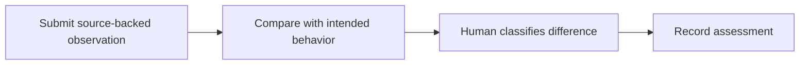

# 20: Intended and observed behavior comparison

Status: Aligning

## Scope

Allow people or agents to submit code-backed observations next to approved product intent. Human reviewers decide whether an observation matches intent, represents an accepted difference, or requires follow-up work.

This is a potential feature proposal, not an implementation commitment. Function
names, routes, storage, and permission choices below are tentative. Follow Uniloom's
existing app guides when implementing; confirm scope and set the plan to Ready first.

## Dependencies and sequencing

Plan 16; plan 18 when observations reference approved specification revisions. Source references require repository identity and a commit SHA.

Plan numbers are stable identifiers, not the build order. These proposals do not
replace MVP.md or authorize bringing later capabilities forward.

## Done when

- [ ] A member or their agent can submit an observation with a behavior summary, story/criterion context, repository, commit SHA, and file/symbol or line reference.
- [ ] The comparison page displays intended behavior and submitted observations with their provenance, without overwriting the story or specification.
- [ ] A human Owner or Manager can classify an observation as matching intent, accepted difference, or follow-up needed, with a required explanation for the latter two.
- [ ] Observations pinned to another code or specification revision are visibly historical; classifications retain their reviewer and timestamp.

## Design

| Function / component | Proposed location | What | Why |
| --- | --- | --- | --- |
| `submitObservation` | `modules/observations/observation.service.ts` | Validate context and store an attributed source-pinned claim. | Separate observed code behavior from approved intent. |
| `classifyObservation` | `modules/observations/observation.service.ts` | Record human assessment and explanation. | Make differences explicit rather than silently rewriting requirements. |
| `BehaviorComparison` | `components/observations/behavior-comparison.tsx` | Show intended behavior beside source-backed observations. | Help reviewers assess a concrete mismatch. |

Locations are relative to apps/api/src or apps/web/src. Backend queries stay in
repositories; services own permissions and behavior; handlers describe OpenAPI
contracts; browser calls use generated hooks. Add files only when the slice needs them.

## Boundaries and decisions to confirm

An observation is a claim, not automatic proof that code behaves correctly. This slice does not crawl repositories, run agents, execute tests, or automatically create work. Unreachable source references remain unverified. Include agent-versus-human classification and historical-reference cases in seed data.

Any durable architecture choice identified during alignment should be recorded in a
Proposed ADR before implementation; this proposal does not accept one in advance.

## Changes

Documentation proposal only. No implementation, migration, commit, or push.
Acceptance items remain unchecked until the feature is built and verified.
