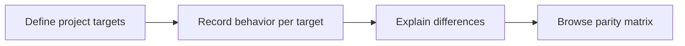

# 21: Platform and repository coverage matrix

Status: Aligning

## Scope

Track how one product behavior is supported across named project targets such as web, mobile clients, or separate repositories. Preserve intentional differences with explanations.

This is a potential feature proposal, not an implementation commitment. Function
names, routes, storage, and permission choices below are tentative. Follow Uniloom's
existing app guides when implementing; confirm scope and set the plan to Ready first.

## Dependencies and sequencing

Plan 16. Evidence from plan 19 can be linked when available.

Plan numbers are stable identifiers, not the build order. These proposals do not
replace MVP.md or authorize bringing later capabilities forward.

## Done when

- [ ] Owners and managers can define named project targets and associate stories with the targets that apply.
- [ ] For each applicable story/target pair, members can record planned, in-progress, implementation-claimed, verified, or not-applicable status with attribution; only eligible humans can mark verified.
- [ ] Known target differences record the behavior, rationale, owner, and whether alignment is planned or the difference is accepted.
- [ ] A matrix distinguishes missing records from not-applicable targets and lets members filter to gaps or differences.

## Design

| Function / component | Proposed location | What | Why |
| --- | --- | --- | --- |
| `setStoryTargetStatus` | `modules/stories/story.service.ts` | Validate target membership and status permissions. | Represent progress per target without a second work hierarchy. |
| `recordTargetDifference` | `modules/stories/story.service.ts` | Store an attributed difference and its disposition. | Preserve product decisions across clients. |
| `PlatformMatrix` | `components/stories/platform-matrix.tsx` | Show story-by-target support and linked explanations. | Expose uneven feature support. |

Locations are relative to apps/api/src or apps/web/src. Backend queries stay in
repositories; services own permissions and behavior; handlers describe OpenAPI
contracts; browser calls use generated hooks. Add files only when the slice needs them.

## Boundaries and decisions to confirm

Status is recorded explicitly; repository existence or a merged PR does not imply verified parity. Target management and human verification rules need seed cases. Automated repository discovery, release version tracking, and multi-repository execution plans are deferred.

Any durable architecture choice identified during alignment should be recorded in a
Proposed ADR before implementation; this proposal does not accept one in advance.

## Changes

Documentation proposal only. No implementation, migration, commit, or push.
Acceptance items remain unchecked until the feature is built and verified.
