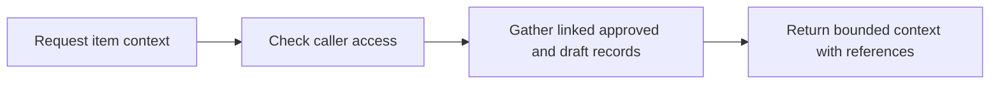

# 22: Agent context packs

Status: Aligning

## Scope

A bounded read that assembles the relevant item, requirements, approved design, decisions, dependencies, and open questions for an agent starting or resuming work.

This is a potential feature proposal, not an implementation commitment. Function
names, routes, storage, and permission choices below are tentative. Follow Uniloom's
existing app guides when implementing; confirm scope and set the plan to Ready first.

## Dependencies and sequencing

MCP access and scoped token identity. Enrich progressively with the available designs, decisions, and plans 15–19; missing capabilities are reported rather than fabricated.

Plan numbers are stable identifiers, not the build order. These proposals do not
replace MVP.md or authorize bringing later capabilities forward.

## Done when

- [ ] An authorized item context read returns the item's current state/checklist/dependencies and summaries of explicitly linked knowledge visible to the caller.
- [ ] The response identifies approved versus draft content, the revisions being cited, unresolved questions, and missing sections.
- [ ] Responses obey a documented size limit and include ids or continuation reads for omitted content; truncation is explicit.
- [ ] REST and MCP context reads call the same service and apply current project membership and token scope, including after membership removal.

## Design

| Function / component | Proposed location | What | Why |
| --- | --- | --- | --- |
| `getItemContext` | `modules/items/item-context.service.ts` | Gather permitted linked records and assemble a bounded response. | Reduce repeated reads while keeping source identity. |
| `getContext / read_item_context` | `REST handler and mcp/tools/` | Expose the same context service through both transports. | Preserve one access-control path. |
| `ContextPreview` | `components/items/context-preview.tsx` | Let a person inspect the context an agent will receive. | Keep the assembled context understandable. |

Locations are relative to apps/api/src or apps/web/src. Backend queries stay in
repositories; services own permissions and behavior; handlers describe OpenAPI
contracts; browser calls use generated hooks. Add files only when the slice needs them.

## Boundaries and decisions to confirm

No server-side agent runs, chat interface, generated policy overrides, or semantic retrieval in this slice. Linked content is data, not authority to change project rules. Use the project's existing explicit module services and generated API client. Repeated context generation should not modify state.

Any durable architecture choice identified during alignment should be recorded in a
Proposed ADR before implementation; this proposal does not accept one in advance.

## Changes

Documentation proposal only. No implementation, migration, commit, or push.
Acceptance items remain unchecked until the feature is built and verified.
