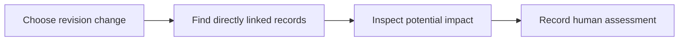

# 23: Change impact analysis

Status: Aligning

## Scope

When a story criterion or specification revision changes, show explicitly linked work and knowledge that may need review. Mark potential impact; do not assert that a link proves breakage.

This is a potential feature proposal, not an implementation commitment. Function
names, routes, storage, and permission choices below are tentative. Follow Uniloom's
existing app guides when implementing; confirm scope and set the plan to Ready first.

## Dependencies and sequencing

Plans 18–19 and explicit document/story relationships. Start with direct links.

Plan numbers are stable identifiers, not the build order. These proposals do not
replace MVP.md or authorize bringing later capabilities forward.

## Done when

- [ ] Comparing two revisions identifies changed criteria or specification sections and their explicit linked records.
- [ ] The impact view includes only records the caller may read and shows why each record was included.
- [ ] A human Owner or Manager can record reviewed, follow-up needed, or not affected for each impacted record, pinned to the source revision change.
- [ ] A subsequent source revision creates a new impact assessment; earlier dispositions remain available without automatically clearing the new assessment.

## Design

| Function / component | Proposed location | What | Why |
| --- | --- | --- | --- |
| `getChangeImpact` | `modules/documents/document.service.ts` | Read the selected change and its direct linked records. | Give a bounded, explainable impact list. |
| `recordImpactAssessment` | `modules/documents/document.service.ts` | Store a human disposition against a particular change. | Retain which change was actually assessed. |
| `ImpactPage` | `components/documents/impact-page.tsx` | Display affected references and assessment history. | Help reviewers follow through on contract changes. |

Locations are relative to apps/api/src or apps/web/src. Backend queries stay in
repositories; services own permissions and behavior; handlers describe OpenAPI
contracts; browser calls use generated hooks. Add files only when the slice needs them.

## Boundaries and decisions to confirm

Semantic impact inference, transitive graph traversal, automatic item moves, and generated change requests are deferred. Stable criterion/section identity needs confirmation; fallback whole-document changes should be labelled explicitly. Seed cases cover access boundaries and assessments of old revisions.

Any durable architecture choice identified during alignment should be recorded in a
Proposed ADR before implementation; this proposal does not accept one in advance.

## Changes

Documentation proposal only. No implementation, migration, commit, or push.
Acceptance items remain unchecked until the feature is built and verified.
