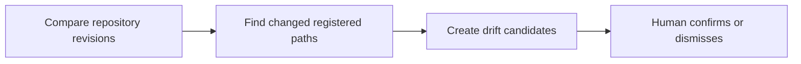

# 24: Documentation drift candidates

Status: Aligning

## Scope

Compare linked source references against newer repository revisions and flag potentially stale specifications. Start with explicitly registered paths and human assessment of the candidate.

This is a potential feature proposal, not an implementation commitment. Function
names, routes, storage, and permission choices below are tentative. Follow Uniloom's
existing app guides when implementing; confirm scope and set the plan to Ready first.

## Dependencies and sequencing

Plan 15, source references pinned to repository/commit, and an authorized repository integration or local import. Source acquisition must be designed before this plan becomes Ready.

Plan numbers are stable identifiers, not the build order. These proposals do not
replace MVP.md or authorize bringing later capabilities forward.

## Done when

- [ ] A comparison accepts a known source revision and newer revision and identifies changed registered paths linked to project specifications.
- [ ] Each drift candidate records the two commits, changed paths, affected document revision, and why it was flagged.
- [ ] Owners and managers can confirm an update is needed or dismiss the candidate with a reason; the decision remains pinned to that comparison.
- [ ] The page distinguishes no detected path changes from unavailable comparisons; retries of the same comparison do not duplicate candidates.

## Design

| Function / component | Proposed location | What | Why |
| --- | --- | --- | --- |
| `findDriftCandidates` | `modules/integrations/source.service.ts` | Compare registered references using already acquired source metadata. | Identify likely staleness without claiming semantic certainty. |
| `assessDriftCandidate` | `modules/documents/document.service.ts` | Record the human disposition of a candidate. | Keep findings separate from accepted requirements. |
| `DriftPage` | `components/documents/drift-page.tsx` | Display source changes and affected specification revisions. | Make documentation maintenance actionable. |

Locations are relative to apps/api/src or apps/web/src. Backend queries stay in
repositories; services own permissions and behavior; handlers describe OpenAPI
contracts; browser calls use generated hooks. Add files only when the slice needs them.

## Boundaries and decisions to confirm

A changed path may not change behavior, and unchanged registered paths do not prove every specification is current. No repository execution, automatic document rewrite, general code crawler, or new background queue in this slice. Integration permissions, event delivery, and polling are separate design decisions.

Any durable architecture choice identified during alignment should be recorded in a
Proposed ADR before implementation; this proposal does not accept one in advance.

## Changes

Documentation proposal only. No implementation, migration, commit, or push.
Acceptance items remain unchecked until the feature is built and verified.
