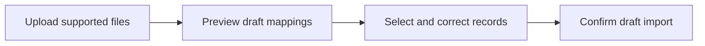

# 25: Preview and import existing knowledge

Status: Aligning

## Scope

Bring Markdown documents and structured story files into a project through a preview-and-confirm flow. Preserve source identity and treat imported content as drafts.

This is a potential feature proposal, not an implementation commitment. Function
names, routes, storage, and permission choices below are tentative. Follow Uniloom's
existing app guides when implementing; confirm scope and set the plan to Ready first.

## Dependencies and sequencing

Plans 15–16. Accepted input formats and size limits must be confirmed before implementation.

Plan numbers are stable identifiers, not the build order. These proposals do not
replace MVP.md or authorize bringing later capabilities forward.

## Done when

- [ ] An Owner or Manager can upload supported Markdown/story files and receive a preview of parsed records, missing fields, duplicates, and unsupported content before persistence.
- [ ] The preview lets the user select records and edit destination kinds/titles; unresolved questions and source provenance remain visible.
- [ ] Confirming imports creates draft documents/stories with source identifiers and an import batch id; it never imports approvals or treats source status as human verification.
- [ ] Repeated imports identify records by source identity and offer explicit skip or new-revision choices; foreign-project writes and oversized or invalid inputs are refused.

## Design

| Function / component | Proposed location | What | Why |
| --- | --- | --- | --- |
| `previewKnowledgeImport` | `modules/imports/import.service.ts` | Parse bounded inputs and report mappings without persisting records. | Make the result reviewable before import. |
| `confirmKnowledgeImport` | `modules/imports/import.service.ts` | Validate the selected preview and create attributed drafts. | Avoid silent overwrites and inherited approvals. |
| `ImportPreview` | `components/imports/import-preview.tsx` | Show proposed records, validation issues, and confirmation. | Let the user choose what enters the library. |

Locations are relative to apps/api/src or apps/web/src. Backend queries stay in
repositories; services own permissions and behavior; handlers describe OpenAPI
contracts; browser calls use generated hooks. Add files only when the slice needs them.

## Boundaries and decisions to confirm

Leave remote repository synchronization, arbitrary archives, external tracker migration, automatic semantic merging, and importing executable agent instructions out. Markdown can remain Markdown; importing does not require reproducing another repository's hierarchy or implementation conventions.

Any durable architecture choice identified during alignment should be recorded in a
Proposed ADR before implementation; this proposal does not accept one in advance.

## Changes

Documentation proposal only. No implementation, migration, commit, or push.
Acceptance items remain unchecked until the feature is built and verified.
