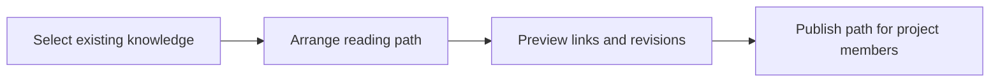

# 26: Curated product onboarding paths

Status: Aligning

## Scope

A project owner or manager can arrange existing knowledge into a short reading path explaining concepts, user flows, architecture, and decisions.

This is a potential feature proposal, not an implementation commitment. Function
names, routes, storage, and permission choices below are tentative. Follow Uniloom's
existing app guides when implementing; confirm scope and set the plan to Ready first.

## Dependencies and sequencing

Plan 15; links to stories and decisions become available as those capabilities ship.

Plan numbers are stable identifiers, not the build order. These proposals do not
replace MVP.md or authorize bringing later capabilities forward.

## Done when

- [ ] Owners and managers can create an onboarding path with a title, intended audience, introduction, and ordered references to same-project knowledge.
- [ ] Members can open the path and move through its references with explanatory notes; ordering remains stable across edits.
- [ ] Missing or archived references are visibly flagged, and non-members cannot read the path or linked content.
- [ ] Editors can preview the full path and choose whether each reference follows the current document or pins a specific revision when revisions are available.

## Design

| Function / component | Proposed location | What | Why |
| --- | --- | --- | --- |
| `saveOnboardingPath` | `modules/documents/onboarding.service.ts` | Validate permissions, references, and explicit order. | Keep curated reading paths within project access. |
| `getOnboardingPath` | `modules/documents/onboarding.service.ts` | Resolve references and mark missing or archived records. | Make stale onboarding content visible. |
| `OnboardingPathPage` | `components/documents/onboarding-path.tsx` | Present the ordered reading journey. | Help newcomers understand the product. |

Locations are relative to apps/api/src or apps/web/src. Backend queries stay in
repositories; services own permissions and behavior; handlers describe OpenAPI
contracts; browser calls use generated hooks. Add files only when the slice needs them.

## Boundaries and decisions to confirm

No learning management system, quizzes, completion analytics, personalized recommendations, or generated tutorials. Publishing makes the path available only to existing project members. Reference validation and access restrictions need seed examples.

Any durable architecture choice identified during alignment should be recorded in a
Proposed ADR before implementation; this proposal does not accept one in advance.

## Changes

Documentation proposal only. No implementation, migration, commit, or push.
Acceptance items remain unchecked until the feature is built and verified.
