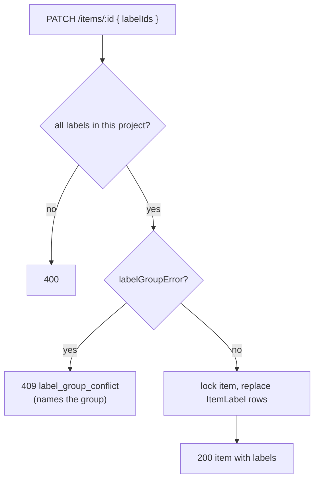
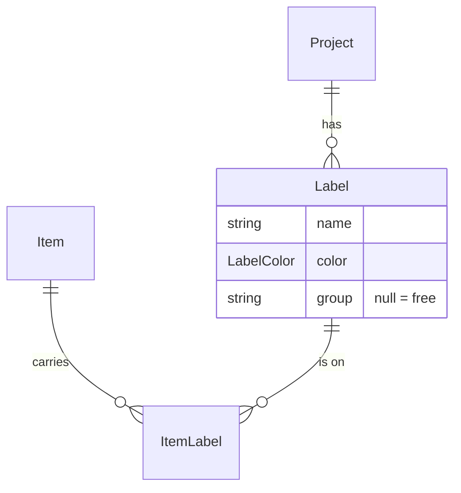

# 27: Labels

Status: In Review

## Scope

Labels from the data model (`MVP.md` §4, §14 step 2): the owner manages a project's
labels, anyone who can edit an item puts labels on it, and labels show as coloured chips.

- **A label** has a name (unique per project), a colour and an optional group.
- **Colour** is one of a fixed palette: `GRAY`, `RED`, `ORANGE`, `YELLOW`, `GREEN`,
  `BLUE`, `PURPLE`, `PINK`. The API stores the name only. The web maps it to
  `--label-*` CSS variables with light and dark values (ADR-0005). No icons (user
  decision).
- **Groups are exclusive** (§4 "one `type` label"): two labels with the same group name
  can't be on one item. A label without a group combines freely. A group is just a text
  field on the label, so there is no group table.
- **New projects start with a `type` group**: `bug` (red), `enhancement` (blue),
  `chore` (gray), `tech-debt` (orange), in both modes. Not `feature` as in `MVP.md` §4
  (user decision): Feature is already a Kind in Guided mode, and a label says what kind
  of work an item is (new functionality, a fix, upkeep, debt), not where it sits in the
  tree. Any label goes on any kind. The owner can rename, recolour or delete
  them. Existing projects get no labels; their owners add them on the settings page.
- **Group changes apply from then on** (as in plan 13): moving a label into a group
  doesn't touch items that already carry two labels of it. The next label edit on such
  an item has to resolve it.
- **Who may do what** (ADR-0010, user decision): owners and managers create labels and
  change their name and colour. Only the owner changes a label's group or deletes it,
  because those change existing items and, later, the rules. Anyone who may edit an item
  (every member) sets its labels.

Left out:

- **Label overrides** (`bug` and `chore` skip the design): they need designs (§14 step 7).
- **Filtering by label**: plan 28.
- **The MCP `list_labels` tool**: it comes with the MCP server.

## Done when

- [x] `GET /projects/:id/labels` (any member); `POST /projects/:id/labels` and
      `PATCH /labels/:id` for name and colour (owners and managers); a group change and
      `DELETE /labels/:id` (owner only). Others get 403, non-members 404. A duplicate
      name in the project returns `409 label_name_taken`.
- [x] `PATCH /items/:id` takes `labelIds` (replaces the set). Two labels of one group
      return `409 label_group_conflict` naming the group; a label from another project
      returns `400`. Covered by unit tests (`labelGroupError`) and e2e tests.
- [x] New projects get the `type` group, and deleting a label removes it from every item.
      Item rows and `GET /items/:id` return `labels: { id, name, color }[]`.
- [x] The settings page has a Labels section: owners and managers add, rename and
      recolour labels; only the owner regroups and deletes them (delete asks to confirm);
      members see it read-only. `GET /projects/:id` returns `canCreateLabels`.
- [x] Board cards and the item page show labels as coloured chips, and the item page has a
      label picker where picking a label swaps out the other one of its group (user decision).
- [x] The seed has an item that has `bug` (try adding `chore` → refused), a free label
      that combines with `bug`, and a label to delete; titles say what to try.

## Design

| Function                                | File                                                                  | What                                                                                                                                                                                                                                                                                                                          | Why                                                                             |
| --------------------------------------- | --------------------------------------------------------------------- | ----------------------------------------------------------------------------------------------------------------------------------------------------------------------------------------------------------------------------------------------------------------------------------------------------------------------------- | ------------------------------------------------------------------------------- |
| `Label`, `ItemLabel`, `LabelColor`      | `prisma/schema.prisma` + migration                                    | `Label { id, projectId, name, color, group?, createdAt }`, `@@unique([projectId, name])`, cascade on project. `ItemLabel { itemId, labelId }` with a composite id, cascade on both sides (like `ItemBlock`).                                                                                                                  | Done-when 1–3. A cascade removes a deleted label from items with no extra code. |
| `PRESETS[mode].labels`                  | `projects/project.presets.ts`                                         | The four `type` labels, created in `createProject` with the states and the owner.                                                                                                                                                                                                                                             | Done-when 3. One transaction, same as states.                                   |
| `labels` module                         | `modules/labels/label.{routes,handlers,service,repository,schema}.ts` | List, create, update, delete. The service calls `requireMember` for the list, `requireRole(…, CREATORS)` for create and for name or colour changes, and `requireRole(…, ['OWNER'])` when the body changes `group` and for delete. The repository returns null on a `P2002` like `createProject`, and the service answers 409. | Done-when 1. Same module layout as the others (ADR-0004).                       |
| `getProject` (changed)                  | `projects/project.service.ts`                                         | Adds `canCreateLabels: CREATORS.includes(role)`.                                                                                                                                                                                                                                                                              | Done-when 4. The web reads the flag (ADR-0007).                                 |
| `labelGroupError(labels)`               | `items/item.rules.ts`                                                 | Message naming the first group used twice in the given labels, else null.                                                                                                                                                                                                                                                     | Done-when 2. Pure, unit tested, and the MCP `save_item` tool will call it.      |
| `updateProjectItem` (changed)           | `items/item.service.ts`                                               | When `labelIds` is given: load those labels (400 if any is missing or in another project), `labelGroupError` (409), then inside the existing transaction, lock the item, delete its `ItemLabel` rows and insert the new ones.                                                                                                 | Done-when 2. The lock stops two edits from mixing their sets.                   |
| `itemView`, `toItem`, schemas (changed) | `items/item.repository.ts`, `item.utils.ts`, `item.schema.ts`         | Include `labels: { label: { id, name, color } }` and flatten to `labels`.                                                                                                                                                                                                                                                     | Done-when 3, 5.                                                                 |
| `LabelChip`, `LABEL_COLORS`             | `web/components/items/item-meta.tsx`                                  | Colour name → CSS variable classes; a small rounded chip.                                                                                                                                                                                                                                                                     | Done-when 5. With the other item bits (ADR-0005).                               |
| `LabelsSection`                         | `web/components/projects/labels-section.tsx`                          | Rows of name, colour picker and group inputs with Save and Delete; an add row. Name, colour and the add row need `canCreateLabels`; group and Delete need `canEditSettings`.                                                                                                                                                  | Done-when 4.                                                                    |
| `LabelPicker`                           | `web/components/items/item-detail.tsx`                                | Multi-select of the project's labels; picking a label drops the other one of its group, then calls `useUpdateItem` with `labelIds`.                                                                                                                                                                                           | Done-when 5.                                                                    |
| `seedLabels`                            | `api/scripts/seed.ts`                                                 | The cases in done-when 6, in the Guided seed project.                                                                                                                                                                                                                                                                         | Done-when 6.                                                                    |

Routes:

| Method and path                   | Who                                        | Errors                                    |
| --------------------------------- | ------------------------------------------ | ----------------------------------------- |
| `GET /projects/:id/labels`        | any member                                 | 404                                       |
| `POST /projects/:id/labels`       | owner, manager                             | 400, 403, 404, 409 `label_name_taken`     |
| `PATCH /labels/:id`               | name, colour: owner, manager; group: owner | 400, 403, 404, 409 `label_name_taken`     |
| `DELETE /labels/:id`              | owner                                      | 403, 404                                  |
| `PATCH /items/:id` (+ `labelIds`) | any member                                 | 400, 403, 404, 409 `label_group_conflict` |

### Setting an item's labels

### Data

## Changes

Tech debt: `docs/tech-debt/008-label-deleted-while-saving.md` (a label deleted mid-save returns 500).

Commits:

- `e3e7e50` feat(api): project labels with exclusive groups
- `58d92ef` feat(web): label chips, label picker and labels settings

What changed and how:

- Schema and migration `20261007072531_labels`: `LabelColor`, `Label` (unique
  `[projectId, name]`, cascade on project) and `ItemLabel` (composite id, cascade on item
  and label). Applied to the dev database by `bun run db:migrate`.
- `labels` module (`label.{routes,handlers,service,repository,schema,utils}.ts`),
  mounted in `routes/index.ts`: `GET` and `POST /projects/:projectId/labels`, `PATCH` and
  `DELETE /labels/:id`. The service uses `requireRole` with `ROLES` (list), `CREATORS`
  (create, name, colour) and `['OWNER']` (a group on create, a change of group, delete).
  Sending the group a label already has is not a change of group, so a manager saving a
  row with an unchanged group works. The repository returns null on `P2002` and the
  service answers 409 `label_name_taken`.
- `createProject` creates the four `type` labels from `PRESETS[mode].labels` in its
  nested create; `getProject` returns `canCreateLabels`.
- `labelGroupError` in `item.rules.ts` (unit tested in `item.service.spec.ts`).
  `updateProjectItem` takes `labelIds`: duplicates are dropped, 400 `invalid_labels` for
  a missing label or one of another project, 409 `label_group_conflict` naming the group,
  then in the transaction it locks the item and replaces its `ItemLabel` rows.
  `itemView`, `toItem`, `toListRow` and the schemas return `labels: { id, name, color }[]`
  sorted by name.
- E2E: new `test/labels.e2e-spec.ts` (roles, 404/403/409/400, group conflict, group
  changes not touching old items, cascade delete, `canCreateLabels`); the OpenAPI
  operation list in `app.e2e-spec.ts` and the slim-row shape in `items.e2e-spec.ts` follow.
- Web: `--label-*` colours (light and dark) and `--color-label-*` in `globals.css`;
  `LabelChip`, `LabelTag`, `LabelDot` and `LABEL_COLORS` in `item-meta.tsx`; outlined
  tags on board cards (`CardFace`); the picker lists labels under their group's heading
  with a colour square, and the closed box shows square + name;
  `LabelPicker` in `item-detail.tsx` (a multi-select box, Base UI `Select multiple`;
  picking a label swaps out the other one of its group); `labels-section.tsx` rendered on the settings page. `openapi.json` and the
  generated hooks regenerated.
- Seed: in `TG`, an item with `bug` (add `chore` → refused, `frontend` → works), an item
  with `delete-me` to delete in Settings, and a Labels line in the "Try:" list.

Planned vs actual: as planned, except `seedLabels` is a block at the end of `seedGuided`
instead of its own function, since it needs that project's `item` helper and the repo
rules forbid passing functions around. Not exercised: the web pages were typechecked,
linted and built but not clicked through in a browser. The dev database's `TG` seed
project had been renamed to "Seed · Guided - Owner", which makes the seed refuse to run;
it was renamed back to "Seed · Guided" (the seed deletes and recreates it anyway) so the
seed could run.
