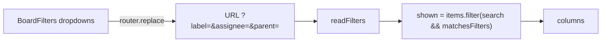

# 28: Board filters

Status: Ready

## Scope

The board's filters from `MVP.md` §11 ("filter by assignee, label, feature"), plus the
assignee filter plan 10 left for later. Builds on plan 27's labels.

- **Frontend only** (user decision): the board already loads every item of the project
  and filters the search box in the browser (`board.tsx`). Filtering isn't a permission
  rule, so it doesn't belong in the API. Query parameters on `GET /projects/:id/items`
  come with the MCP `list_items` tool, which needs them for slim responses.
- **Filters combine** (AND across kinds, OR within one): e.g. labels `bug` or `chore`,
  assigned to me.
- **The filter lives in the URL** (`?label=…&assignee=…&parent=…`), so a filtered board
  can be shared, bookmarked and survives a reload. The search box stays as it is.

Left out:

- **API filtering and paging**: with MCP, or when a project grows past what one request
  handles.
- **Saved views**.

## Done when

- [ ] A label filter on the board: pick one or more labels; only items with any of them
      show.
- [ ] An assignee filter: pick members, "Me" or "Unassigned"; only matching items show.
- [ ] A feature (or task) filter: pick a parent; the board shows it and its children.
- [ ] The filters are read from and written to the URL; a Clear button resets them, and
      the board shows a short note when no item matches.

## Design

| Function                              | File                                     | What                                                                                                                                                                 | Why                                                        |
| ------------------------------------- | ---------------------------------------- | -------------------------------------------------------------------------------------------------------------------------------------------------------------------- | ---------------------------------------------------------- |
| `readFilters(searchParams)`           | `web/components/board/board-filters.tsx` | Turns `label`, `assignee`, `parent` params (comma-separated ids, `me`, `none`) into a `{ labelIds, assigneeIds, parentId }` object.                                  | Done-when 4. One place parses the URL.                     |
| `matchesFilters(item, filters, meId)` | `web/components/board/board-filters.tsx` | True when the item passes every set filter.                                                                                                                          | Done-when 1–3. Joins the existing search check in `shown`. |
| `BoardFilters`                        | `web/components/board/board-filters.tsx` | Three dropdowns (labels with chips, members with avatars, parents) and Clear, next to the search box. Writes with `router.replace` so filters don't pile up history. | Done-when 1–4.                                             |
| `Board` (changed)                     | `web/components/board/board.tsx`         | `useSearchParams`, `readFilters`, and `matchesFilters` in the `shown` filter.                                                                                        | Done-when 1–4.                                             |

## Changes

Filled in at the end.
