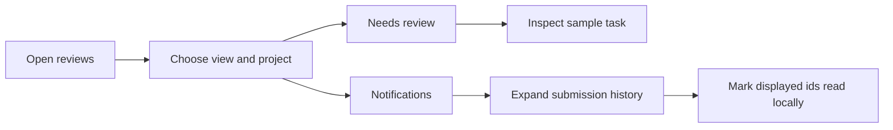

# 29: Review inbox UI preview

Status: In Review

## Scope

The user authorized a UI-first inbox with sample data and local read/unread
interactions, and set this scope Ready. Build this before plans 30, 28, and 14.
No backend changes or new workflow authority checks in this slice.

## Done when

- [x] /reviews renders inside AppShell, appears in primary navigation, and redirects signed-out visitors to login.
- [x] Needs review displays sample review items with project, assignee, priority, state, and an inline item preview without linking to nonexistent tasks.
- [x] Notifications groups submission history by task, retains completed/returned examples, expands individual submissions, and marks displayed entries read on opening and allows marking them unread again in local state.
- [x] Project filtering, unread-only filtering, counts, and empty states respond to local interaction; resetting the preview restores sample read state.
- [x] The interface is responsive, uses existing theme tokens and item metadata components, provides labelled keyboard-operable controls.
- [x] Web lint, typecheck, and build pass; preview limitations and subsequent integration are documented.

## Design

| Component / data  | File (apps/web/src/)                       | What                                                                     | Why                                                      |
| ----------------- | ------------------------------------------ | ------------------------------------------------------------------------ | -------------------------------------------------------- |
| ReviewsPage       | app/reviews/page.tsx                       | Render AppShell and ReviewInbox.                                         | Keep routing separate from UI.                           |
| ReviewInbox       | components/reviews/review-inbox.tsx        | Own view, filters, open notification groups, and explicit read ids.      | Keep interactions visible in one feature.                |
| ReviewItemPreview | components/reviews/review-item-preview.tsx | Show sample task context directly below its task in a native disclosure. | Provide an inspection flow without fictional item links. |
| NotificationGroup | components/reviews/notification-group.tsx  | Read displayed submissions on opening and allow marking them unread.     | Keep repeated submissions inspectable and independent.   |
| REVIEW_ITEMS      | components/reviews/review-samples.ts       | Typed, deterministic sample tasks and submission history.                | Isolate fixtures from future API integration.            |

Read state lasts for this mounted preview only. No persistence, inbox API calls, pagination,
notification delivery, or task moves. The page visibly identifies sample data.
Plan 14 retains live API integration; plans 30 and 28 remain unimplemented.

## Verification

Run web lint, typecheck, and build. Check grouping/filter/read-state interactions
against the fixed sample data, plus responsive markup and accessible controls.

## Changes

Implemented the UI preview. User refinement: previews now expand directly under
their related task, using native details/summary controls. Queue previews form an
accordion; notification previews stay inside their task history group. No separate
preview panel or focus jump. Backend plans remain unimplemented. Committed with its related implementation; publishing in the review inbox PR.

Web lint, standalone typecheck, and production build pass. A temporary Playwright
check with isolated browser cookies and mocked shell/auth responses verified:
signed-out redirect, queue accordion behavior, automatic reads, mark unread,
reopening reads, stable Unread only inspection, nested preview toggle isolation,
project filtering, empty state, reset, keyboard controls, and no horizontal overflow at 320px/375px. No browser runtime errors.
Desktop and mobile screenshots were checked. Checks use sample data; no real user
session or notification delivery was involved. Commits: none; pushes: none.

User refinements: opening a notification group marks its loaded, displayed
submissions read immediately. An open group stays visible under Unread only until
closed; Mark as unread remains effective while it is open. Reopening reads those
submissions again.

The user requested reverting the animation changes. Removed the disclosure CSS
transitions and their styling hooks; native previews now open/close immediately.
Inline placement, automatic reads, Mark as unread, and stable unread filtering stay
as implemented. Committed with its related implementation; publishing in the review inbox PR.

The user subsequently authorized live integration in plan 14. The sample records and
reset control have been replaced there with generated API hooks and persistent per-user
read state. Task and project links are now actionable, with independent preview controls.
The introductory descriptions were removed at the user’s request.
