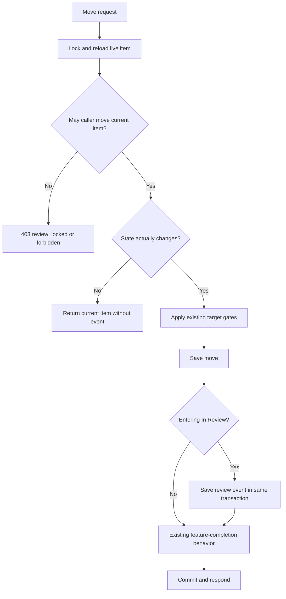

# 30: Review boundary and submission events

Status: In Review

## Scope

First slice of the review inbox, split with the user's confirmation. Enforce the
review handoff and record each genuine submission as a durable event. The existing
move endpoint and board/item permission flags change; notification processing and
the inbox page arrive in plans 31 and 14.

The user chose: Members cannot move items out of In Review, Owners and Managers
can, and a returned item follows the normal assignment rules again. The user's
"admin" maps to the existing project Owner role. Scope applies to live items with
state key `in_review`; it introduces no new roles or Standard-mode review states.

## Dependencies

Existing items, states, membership, checklist gates, and
[ADR-0008](../adr/0008-services-run-transactions.md).
[ADR-0011](../adr/0011-review-events-and-notifications.md) is Accepted for the authorized live implementation. Build order: **30 → 31 → 14**.

## Done when

- [x] An assigned Member can enter In Review under existing checklist rules, but a subsequent move to another state returns 403 `review_locked`; Owner/Manager moves remain allowed under existing gates, and a reviewer returning the item restores normal Member move permission.
- [x] Detail and board-list responses use the same state-aware move rule: `canMove` is false for a Member on an In Review item and true for an eligible Owner/Manager. Existing move controls honor those flags.
- [x] Every actual move from another state into `in_review` saves one review event with item/project, actor, previous/next state, submission time, and the proposed recipient snapshot. It commits with the move; failed or unchanged moves produce no event, and returning then resubmitting produces a new event.
- [x] The move service locks and reloads current source state before checking move authority, deciding whether the request changes state, and recording its event; concurrent submissions cannot duplicate an event or let a stale Member request move a reviewed item back.
- [x] Failure to persist the event rolls back its task move; an unavailable notification worker leaves committed moves and pending events intact. Event content stays historical when the task later changes state.
- [x] Seed projects contain named examples for submitting, Member move refusal, reviewer return, and resubmission; API cases demonstrate the role/flag behavior, event counts, concurrent submission, and transaction rollback.

## Design

Locations below are relative to apps/api/src unless stated otherwise. These are
concrete proposals to confirm at the implementation checkpoint, not implemented code.

| Function                                   | File                                             | What                                                                                                       | Why                                                                           |
| ------------------------------------------ | ------------------------------------------------ | ---------------------------------------------------------------------------------------------------------- | ----------------------------------------------------------------------------- |
| `mayMove`                                  | modules/items/item.rules.ts                      | Include source-state key in the existing role/assignment check.                                            | One rule for writes and response flags.                                       |
| `findItemForMove(tx, id)`                  | modules/items/item.repository.ts                 | Reload a live item and the fields needed for move rules after its lock.                                    | Enforce the review boundary against current state.                            |
| `moveItem`                                 | modules/items/item.service.ts                    | Lock → reload → authorize → no-op/gates → move → record submission → existing feature-completion behavior. | Keep ordering readable and the event atomic with the transition.              |
| `recordReviewSubmission(tx, input)`        | modules/notifications/notification.service.ts    | Capture recipient ids and call the repository to persist the submission.                                   | Let the item module call another module's service using the same transaction. |
| `findReviewRecipients / insertReviewEvent` | modules/notifications/notification.repository.ts | Read Owner/Manager ids and insert the event through tx.                                                    | Keep queries in a repository.                                                 |
| `toItem / toListRow`                       | modules/items/item.utils.ts                      | Pass source-state key to the same move rule.                                                               | Disable stale UI affordances without duplicating policy.                      |

Proposed `ReviewEvent` data: UUID id; project/item references; nullable actor reference;
previous/next state ids and key snapshots; submittedAt; recipientIds snapshot; and
processing fields attempts, nextAttemptAt, processedAt, failedAt, lastError.
The event body is append-only; only processing metadata changes. Project deletion
can remove project-owned history; actor deletion clears the relation rather than
deleting the event. Exact schema and migration remain part of alignment.

## Proposed additions to confirm

- Snapshot all Owner/Manager recipient ids when the submission is recorded, including
  the acting user if they have one of those roles. Finer recipients and self-notification
  preferences are future improvements.
- Later delivery and reads must recheck current review authority so removed or demoted
  recipients cannot receive exposed project content. Newly promoted reviewers see
  current review work but do not automatically inherit old notification history.
- Event recording is required for a successful submission; notification processing is
  independent. This is the remaining durability boundary discussed with the user.

No creation-in-review event, synthetic backfill for existing reviewed items, general
activity stream, email delivery, rate limiter, or queue dependency in this slice.
Existing reviewed items appear in the later live queue without invented submission
history. Direct item creation in In Review retains existing creation behavior.

## Verification

Focused rule tests and database-backed move/e2e cases above, then API lint, typecheck,
and build. Use a deterministic concurrent-request test and injected event-persistence
failure to check transaction behavior. Regenerate the API specification only if its
documented response/error contract changes. Add every new rule case to the seed.
Follow the repository's database workflow; do not start a local database by default.

## Changes

Implemented state-aware move authorization and flags. The move transaction locks and
reloads the source item, rechecks membership, preserves existing checklist/Done gates,
and inserts one event per genuine review submission. Event recording and the task
move commit together; later notification failures cannot undo the move.

Added ReviewEvent/Notification schema and migrations; actor deletion retains event
history. API cases cover Member handoff/return, reviewer flags, unchanged moves,
concurrent submission, stale Member requests, rollback, and resubmission. Seed TI
shows grouped submissions and historical work; TM lets the signed-in Member try
review lock and return behavior directly.

Planned vs actual: delivery storage is created with the event schema to avoid a
second table rollout. An accidental second create-only migration is empty and was
already applied to the dedicated dev database; it is retained unchanged under the
repository's applied-migration rule. There is no schema effect from it.
Committed with its related implementation; publishing in the review inbox PR. API lint/typecheck/build and focused/database tests pass.
[TD-009](../tech-debt/009-review-history-retention.md) tracks deferred retention.
