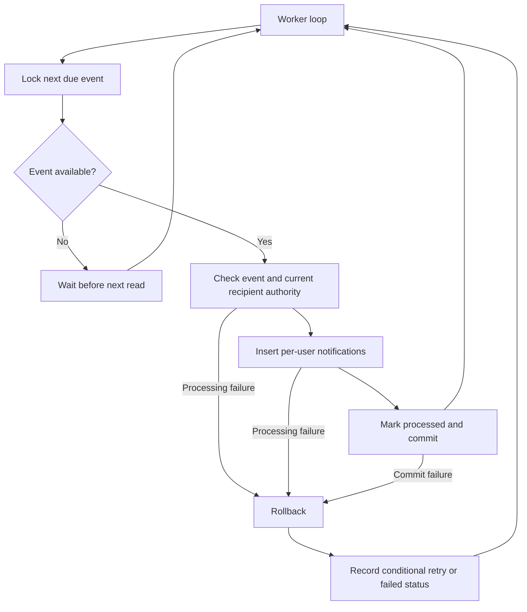

# 31: Review notification processing

Status: In Review

## Scope

Second review-inbox slice: a small Bun worker turns pending review events into
standalone per-user in-app notification records. It uses the existing PostgreSQL
database and explicit module services; it adds no queue package or message broker.
Failures in this processing do not undo a committed task move.

The user chose independent recipient notifications and all project Owners/Managers
as the initial recipient policy. Recipient timing and access details below are
proposed additions, not silently accepted product decisions.

## Dependencies

[Plan 30](30-review-boundary-and-events.md) creates review events.
[ADR-0011](../adr/0011-review-events-and-notifications.md) is Accepted.
The worker can be exercised without the web inbox; [plan 14](14-review-inbox.md)
adds user-facing reads. Build order: **30 → 31 → 14**.

## Done when

- [x] A separate Bun worker processes due events in bounded batches, with short PostgreSQL row-locking transactions; multiple workers skip claimed events, and restarting after an interrupted transaction leaves the event available.
- [x] Processing creates one standalone notification per event and eligible snapshotted recipient, then marks the event processed in the same transaction. A unique event/recipient constraint makes repeated processing safe.
- [x] Before delivery, the worker checks current project membership and Owner/Manager authority. Deleted projects/items and recipients without review authority produce no exposed notification content and are handled explicitly rather than retrying forever.
- [x] Processing failures retain the event and persist attempt count, next retry time, and a sanitized error; retry timing increases to a cap, exhausted events are visibly failed, and database outages back off without a tight loop.
- [x] Notifications retain their event link and individual read state; historical notifications survive later task completion, and recipient removal cannot expose their content through later inbox reads.
- [x] Root/API worker scripts, API image build, and a Docker worker service support independent startup, graceful shutdown, and restart; seed cases and database checks demonstrate fan-out, crash recovery, duplicate prevention, revoked access, and failed-event recovery.

## Design

| Function                                   | File, relative to apps/api/src                   | What                                                                                                          | Why                                                                    |
| ------------------------------------------ | ------------------------------------------------ | ------------------------------------------------------------------------------------------------------------- | ---------------------------------------------------------------------- |
| `processNextReviewEvent`                   | modules/notifications/notification.service.ts    | Run one short transaction: lock next due event, validate it, create permitted recipient rows, mark processed. | Keep in-app fan-out atomic.                                            |
| `findNextDueEvent(tx)`                     | modules/notifications/notification.repository.ts | Ordered bounded read with FOR UPDATE SKIP LOCKED.                                                             | Coordinate consumers without a separate broker.                        |
| `insertNotifications / markEventProcessed` | modules/notifications/notification.repository.ts | Insert deduplicated per-user rows and finish the event through tx.                                            | Preserve standalone read state and safe retries.                       |
| `recordProcessingFailure`                  | modules/notifications/notification.service.ts    | Re-lock the event in a separate transaction after rollback and schedule retry only if still pending.          | Avoid overwriting success recorded by another worker.                  |
| `retryDelay`                               | modules/notifications/notification.rules.ts      | Calculate a capped delay from attempts.                                                                       | Keep retry policy explicit and testable.                               |
| `runNotificationWorker`                    | notification-worker.ts                           | Await processing sequentially, pause when idle/unavailable, and stop cleanly on shutdown.                     | Give the worker its own lifecycle without overlapping timer callbacks. |

Proposed `Notification` data: UUID id, eventId, recipientId, projectId, itemId,
createdAt, readAt (nullable), plus a unique (eventId, recipientId) constraint.
Keep one row per real event/recipient; plan 14 groups presentation without deleting
these historical rows. Read state belongs to that recipient only.

The worker imports database/notification modules directly and does not bootstrap
the API's auth discovery or HTTP server. The API image builds a second entry point;
Docker runs it with DATABASE_URL after migrations succeed.

## Proposed additions to confirm

Retry defaults: start at 5 seconds, increase exponentially to a 5-minute cap,
and mark failed after 10 processing failures. Log failure and event id; a narrowly
scoped administrative script can requeue a failed event after the cause is fixed.
Idle polling defaults to 2 seconds. Database outages pause the loop; they cannot
persist failure metadata while storage itself is unreachable.

Events remain stored for review history; processed records are excluded from due
queries. Retention/archival policy is deferred and must be set before large-scale use.

No external network calls occur while holding event locks. Email/push/webhook
delivery belongs in future per-channel jobs with their own retries. No notification
preferences, dashboards, external delivery adapters, or generic job framework now.
Future improvement: task-specific reviewers or configurable review subscriptions.

## Verification

Database-backed cases cover two workers claiming separate events, aborted processing,
reprocessing the same event, per-recipient independence, role loss, deleted work,
and conditional retry updates. Check the capped retry calculation and worker build,
then the API lint/typecheck/test commands and Docker configuration. Seed records
must make recipient-policy and access-revocation behavior observable.

## Changes

Implemented an independent Bun worker, PostgreSQL event claims using FOR UPDATE
SKIP LOCKED, atomic recipient fan-out and completion, unique event/recipient rows,
current-recipient eligibility checks, capped retries, sanitized failure metadata,
and an operator-only requeue command. Root dev and Compose run the worker separately;
the API image builds both entries. Notification delivery imports no auth server.

Database checks demonstrate lock skipping, recovery after a rolled-back claim,
duplicate prevention, rollback after partial fan-out, conditional retry bookkeeping,
role revocation, deleted work, terminal failure and manual retry. The retry unit case
passes. A real worker run delivered the TI seed's four events into eight notifications,
and exited successfully on SIGTERM. Docker Compose configuration validates.

Planned vs actual: claiming and in-app delivery remain one short transaction, so a
crash does not require a lease or separate claim-state cleanup. Worker outages delay
history without blocking current review work. No broker, email or generic job layer.
[TD-009](../tech-debt/009-review-history-retention.md) tracks retention and future query
measurement. Committed with its related implementation; publishing in the review inbox PR.
