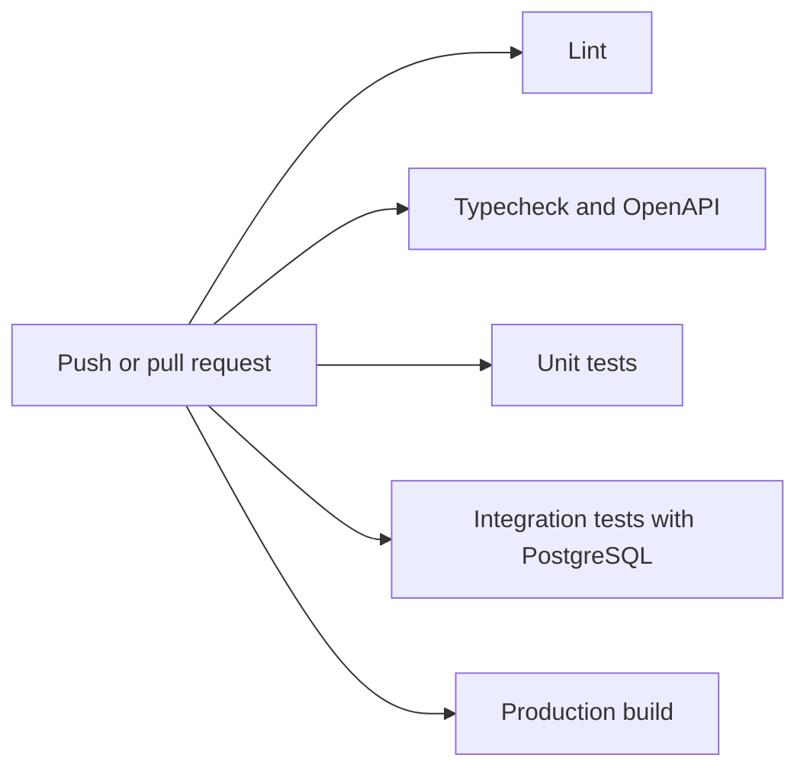

# 32: Separate CI jobs

Status: In Progress

## Scope

The user confirmed five jobs in one CI workflow and requested committing directly
on dev and promoting the result to main. Preserve all current checks, push/PR
triggers, Bun version, frozen installs, and release-bot exclusion. Keep Docker
publishing and release workflows separate.

## Done when

- [x] CI has five independent named jobs: Lint, Typecheck & OpenAPI, Unit tests, Integration tests, and Build, with no sequential job dependencies.
- [x] Every job installs dependencies and generates the clients it needs; Typecheck checks committed OpenAPI consistency before generating browser hooks, and all original check commands remain covered.
- [x] PostgreSQL and migration deployment belong only to Integration tests; all jobs retain main/dev push and pull-request triggers and the release-bot exclusion.
- [ ] Workflow validation and the five dev CI jobs pass; documentation explains the split, and the committed change is promoted to main without modifying Docker/release behavior.

## Design

| Job               | File                     | Steps                                                       | Why                                                       |
| ----------------- | ------------------------ | ----------------------------------------------------------- | --------------------------------------------------------- |
| lint              | .github/workflows/ci.yml | Install, Prisma, browser hooks, lint                        | Type-aware lint has generated types.                      |
| typecheck         | .github/workflows/ci.yml | Install, Prisma, spec drift check, browser hooks, typecheck | Catch stale API contracts and type errors together.       |
| unit-tests        | .github/workflows/ci.yml | Install, Prisma, unit tests                                 | Fast pure/mocked checks have their own result.            |
| integration-tests | .github/workflows/ci.yml | PostgreSQL service, install, Prisma, migrations, e2e tests  | Confine real database setup to the job that uses it.      |
| build             | .github/workflows/ci.yml | Install, Prisma, API/web production builds                  | Verify bundling and Next production output independently. |

Each job has its own runner, setup, outcome, and rerun path. Repeated installs cost
runner time; no shared setup artifact, custom action, caching framework, or separate
workflow files are introduced. Generation-only jobs use the existing dummy database
URL without connecting to a database. No app data or workflow rule changes, so no
new seed scenarios are needed.

## Changes

Implemented five jobs with no needs dependencies. Preserved the existing triggers,
release-bot exclusion, Bun 1.4.2, frozen installs, OpenAPI drift check, unit/e2e
commands, and API/web builds. PostgreSQL and migration deployment are restricted
to Integration tests. Each job prepares its own necessary generated clients.
README and the plan index describe the split. actionlint 1.7.12 and git diff --check
pass. Direct dev/main publication was authorized by the user; dev CI and promotion
verification follow. No Docker/release workflow changes. The plan stops at In Review.
